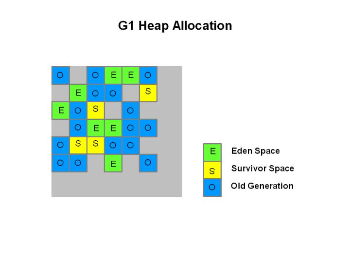

# 运行时数据区域


- 线程共享数据区：方法区（Method Area）， 堆（Heap）
- 线程隔离数据区：虚拟机栈（VM stack），本地方法栈（Native Method Stack）， 程序计数器（Program Counter Register）

### 程序计数器

当前线程所指向字节码的行号指示器。执行java方法时，计数器记录正在执行的字节码指令地址；执行本地方法时，计数器值为空(undefined)。 

**程序计数器是唯一一个没有规定任何*OutOfMemoryError*情况的区域。**

### 虚拟机栈

java方法执行的线程内存模型：每个方法执行时，虚拟机都会同步创建一个栈帧（Stack Frame，栈帧包含存储局部变量表、操作数栈、动态连接、方法出口等)。方法从被调用到执行完毕，对应栈帧在虚拟机栈中从入栈到出栈的过程。

栈空间大小参数：-Xss。

##### 局部变量表

局部变量表用于存放编译期可知的java基本数据类型、对象引用、returnAddress(指向一条字节码指令的地址)。

局部变量表的存储空间以局部变量槽（slot）表示，long、double占用两个槽，其余类型均占用一个槽。
局部变量表所需内存空间在编译期间完成分配。

虚拟机栈存在的异常：StackOverflowError，OutOfMemoryError。（hotspot栈容量不能自动扩展，只要申请栈空间成功就不会触发OutOfMemoryError，申请栈空间失败则出现OOM。）

### 本地方法栈

本地方法栈为虚拟机使用本地方法服务。异常情况与虚拟机栈一致。

### 堆

虚拟机启动时创建。唯一目的就是存放对象实例，几乎（栈上分配、标量替换）所有对象实例都在堆上分配内存。 

**Java堆是垃圾收集器管理的内存区域。**

堆大小相关参数：-Xmx, -Xms。

堆内存不足时抛出OutOfMemoryError

##### TLAB (Thread Local Allocation Buffer)

为了提升对象内存分配的效率，将线程共享的java堆划分成线程私有的多个分配缓冲区。-XX: +/-UseTLAB参数设定是否使用TLAB。

### 方法区

方法区存储已被虚拟机加载的类型信息、常量、静态变量、即时编译器编译后的代码缓存等。

HotSpot JDK 7 及之前使用永久代实现方法区（JDK 7 中把永久代中的字符串常量池（**字符串常量池被移入java堆中**）、静态变量等移除）。JDK 8 开始废弃永久代的概念，使用元空间（Metaspace, 在本地内存中实现）替代，把JDK 7中永久代剩余的内容移到了元空间。（**JDK 8 之后类加载后的Class实例分配在堆上，static变量保存在Class实例中，也在堆上。**）

方法区内存不足时抛出OutOfMemoryError。

##### 运行时常量池（Runtime Constant Pool）

运行时常量池是方法区的一部分。 Class文件中除了有类的版本、字段、方法、接口等描述信息外，还有常量池表（Constant Pool Table）， 用于存放编译期间产生的各种字面量和符号引用，这部分在类加载后存放到运行时常量池中。

并非只有Class文件中常量池的内容才能进入运行时常量池，运行期间也能添加（如String.intern()）。

### 元空间（Metaspace）

-XX:MaxMetaspaceSize： 元空间最大值，默认-1，不限制；
-XX:MetaspaceSize：元空间初始大小(byte), 达到会触发类型数据的垃圾回收，以及空间调整；
-XX:MinMetaspaceFreeRatio： 控制垃圾收集后最小的元空间剩余容量百分比 ；
-XX:MaxMetaspaceFreeRatio：控制垃圾收集后最大的元空间剩余容量百分比。

### 直接内存（Direct Memory）

直接内存不是虚拟机运行时数据区的一部分，可能抛出OutOfMemoryError。

-XX:MaxDirectMemorySize, 默认与java堆最大值（-Xmx）一致。

# Java对象结构

Java对象包括三部分，对象头（Header）， 实例数据（Instance Data）， 对齐填充（Padding）。

*JOL可用于查看Java对象的布局。*（x86： Little Endian； 网络传输：Big Endian）。

```xml
<dependency>
    <groupId>org.openjdk.jol</groupId>
    <artifactId>jol-core</artifactId>
    <version>0.9</version>
</dependency>
```


### 对象头（64bit机器）

##### Mark Word（8字节）

Mark Word存储对象自身的运行时数据，如哈希码、GC分代年龄（4bit）、锁状态标志、线程持有的锁、偏向线程ID、偏向时间戳等。

##### 类型指针（Klass Pointer，（不启用指针压缩时8字节））

类型指针是指向该对象类型元数据的指针。

数组对象的对象头还有一块用于记录数组长度的数据（虚拟机可以通过普通java对象的元数据信息确定对象大小，数组对象大小需要通过数组长度确定）。

### 实例数据

实例数据存储字段内容（**包括从父类继承下来的**，HotSpot默认分配顺序为 longs/doubles、ints、shorts/chars、bytes/boolean、oops（ordinary object pointers），满足上述顺序的前提下父类定义的字段在子类定义的之前。）

### 对齐填充

HotSpot虚拟机任何对象的大小都必须是8字节的整数倍。

# 对象访问

通过栈上的reference数据访问具体对象。有两种访问方式。

### 句柄

需要划出一块内存作为句柄池，reference存储对象的句柄地址，句柄包含对象实例数据地址和类型数据地址


### 直接指针 

HotSpot直接指针的方式。


# Memory Leak

# Memory Overflow

# 垃圾回收（Garbage Collection, GC）

### Java引用

##### 强引用 （Strongly Reference）

`Object obj = new Object()`。只要强引用关系还存在，垃圾收集器就永远不会回收掉被引用的对象。

##### 软引用 （Soft Reference）

SoftReference。 只被软引用关联的对象，在系统将要发生内存溢出前，会把这些对象列进回收范围进行第二次回收，如果这次回收还没有足够的内存，才抛出内存溢出异常。

##### 弱引用（Weak Reference）

`WeakReference`。 当垃圾收集器开始工作，无论当前内存是否足够，都会回收掉只被弱引用关联的对象。

##### 虚引用（Phantom Reference）

`PhantomReference`。 也称为`幽灵引用`或`幻影引用`。一个对象是否有虚引用的存在，完全不会对其生存时间构成影响，也无法通过虚引用取得一个对象实例。为一个对象设置虚引用关联的唯一目的只是为了能在这个对象被回收时收到一个系统通知。

### 哪些内存需要回收？

java堆、方法区。

### 什么时候回收？

##### 引用计数法

存在循环引用问题，hotspot不使用

##### 可达性分析（Reachability Analysis）

###### GC Roots

GC Roots包括虚拟机栈中引用的对象，方法区中类静态属性引用的对象，方法区中常量引用的对象，本地方法栈中JNI（Native方法）引用的对象，java虚拟机内部的引用（Class对象，异常对象，系统类加载器等），被同步锁（synchronized）持有的对象，反映Java虚拟机内部情况的JMXBean、JVMTI中注册的回调、本地代码缓存等。**不同的垃圾收集器和回收的内存区域可以有其他对象临时加入GC Roots集合。**

如果对象在进行可达性分析后发现没有与GC Roots相连接的引用链，被第一次标记，随后进行一次筛选，筛选的条件是此对象是否有必要执行finalize()方法，如果对象没有覆盖finalize()方法或finalize()已被虚拟机调用过则没必要执行。
如果有必要执行finalize()，那么该对象放置在 F-Queue队列中，由一条由虚拟机自动建立的、低调度优先级的Finalizer线程执行它们的finalize()方法。
收集器会对F-Queue中的对象进行第二次小规模的标记，如果对象在finalize()中成功拯救自己（自救机会只有一次），那在第二次标记是它将被移出即将回收的集合。否则就要被回收。

##### 方法区的垃圾收集

方法区的垃圾收集内容：废弃的常量和不再使用的类型

判断不再使用的类型：

1. 该类所有的实例都已被回收（该类及其派生子类）
2. 加载该类的类加载器已被回收
3. 该类对应的java.lang.Class对象没有在任何地方被引用

### 如何回收？

##### 分代收集 Generational Collection

   1. 弱分代假说: weak generational hypothesis, 绝大多数对象都是朝生夕灭的。
   2. 强分代假说: strong generational hypothesis, 熬过越多次垃圾收集过程的对象就越难以消亡。
   3. 跨代引用假说: intergenerational reference hypothesis, 跨代引用相对于同代引用仅占极少数。

java堆分为新生代 young generation，老年代 old generation。

##### 垃圾收集算法

1. 标记-清除算法：Mark Sweep, 缺点：1) 执行效率不稳定，受需要回收对象数量影响大；2) 空间碎片
2. 标记-复制算法：缺点：可用内存空间减少。
   HotSpot把新生代分为 Eden Survivor1 Survivor2, Eden空间较大，每次内存分配只使用Eden和其中一块Survivor，垃圾收集时，将Eden和Survivor中仍存活的对象复制到另一块Survivor上，然后清理掉Eden和已用过的那块Survivor空间。
   默认空间比例 Eden:Survivor = 8:1,当Survivor空间不足以容纳一次Minor GC之后存活的对象时，需要依赖其他内存区域（大多是老年代）进行分配担保（Handle Promotion，如果Survivor空间不足，存活对象直接进入老年代）。
3. 标记-整理算法：Mark Compact

移动和不移动对于吞吐量的影响：
吞吐量受用户程序和收集器影响。不移动提升收集器效率，但是内存分配和访问耗时增加，而这部分比垃圾收集的频率高很多，这部分耗时增加，总的吞吐量是下降的。**关注吞吐量的Parallel Scavenge 基于标记-整理算法。关注延迟的CMS基于标记-清除算法，内存空间碎片化程度很大时，再采用标记-整理算法收集一次。  **

##### 垃圾收集分类

1. Minor GC: Young GC，只回收新生代。

   新生代中建立一个全局的数据结构：记忆集（Remembered Set），把老年代划分成若干小块，标识出老年代的哪一块内存会存在跨代引用。当发生Minor GC，包含跨代引用的小块内存里的对象会加入到GC Root进行扫描。

2. Major GC: Old GC，只回收老年代。目前只有CMS单独收集老年代。

3. Mixed GC: 回收整个新生代和部分老年代。目前只有G1会有这种行为。

4. Full GC: 回收整个java堆和方法区

##### 保守式GC，半保守GC，准确式GC

<a href="https://www.iteye.com/blog/rednaxelafx-1044951">

解决问题： JVM栈上如何判断一个数据是引用类型？

HotSpot采用准确式GC的方式，使用OopMap记录映射表（需要JVM的解释器和JIT编译器提供支持）。


###### OopMap
HotSpot实现细节：

1. GC Roots 枚举： STW (Stop The World)

 	2. OopMap: 可作为GC Roots的节点主要在全局性的引用（如常量或类静态变量）与执行上下（如栈帧中的本地变量表）中。类加载完成后，对象的类型信息里记录自己的OopMap，记录了在该类型的对象内什么偏移量上是什么类型的数据。
     - 每个被JIT编译过的方法也会在特定的位置上（安全点，safe point）记录下OopMap，记录执行到该方法的某条指令时，栈上和寄存器里哪些位置是引用（因此HotSpot中GC只能在safe point处进入）。
     - 而仍然在解释器中执行的方法则可以通过解释器里的功能自动生成OopMap给GC用。
     - Java线程中的JNI方法，它们既不是由JVM里的解释器执行的，也不是由JVM的JIT编译器生成的，所以会缺少OopMap信息。HotSpot采用`句柄`的方式来维持准确性。

###### 安全点 （safe point）

用户程序执行时必须执行到安全点才能暂停进行垃圾回收。 安全点的位置主要在方法调用、循环跳转、异常跳转等。

HotSpot为了避免安全点过多带来过重的负担，对循环有一项优化措施：使用`int`类型或范围更小的数据类型作为索引值的循环默认不会被放置安全点。这种循环被称为可数循环（Counted Loop）。使用long或范围更大的数据类型作为索引的循环被称为不可数循环（Uncounted loop），会被放置安全点。

 -XX:+UseCountedLoopSafepoints 强制在可数循环中也放置安全点（JDK 8 中有bug，有导致虚拟机崩溃的风险），实际处理可将可数循环转换成不可数循环（int → long）。

###### 如何在垃圾回收时让所有线程（不包括执行JNI调用的线程）都跑到最近的安全点，停顿下来？

1. 抢先式中断：preemptive suspension， 当垃圾收集发生时，系统首先把所有用户线程全部中断，如果发现有用户线程中断的地方不在安全点上，恢复这条线程执行，让它一会再重新中断，直到跑到安全点上（几乎没有虚拟机采用抢先式中断）。

2. 主动式中断：voluntary suspension，当垃圾回收需要中断线程时，设置一个标志位，各个线程执行时不停地主动轮询这个标志，一旦发现中断标志为真时就自己在最近的安全点上主动中断挂起。

###### 安全区域（safe region）

对于没有分配处理器时间片的线程，线程无法响应中断请求（执行到安全点挂起）=> 引入安全区域

确保在某一段代码片段中，引用关系不会发生变化 => 区域中任意地方开始垃圾收集都是安全的。

当用户线程执行到安全区域里的代码，标识自己进入了安全区域，这段时间发起垃圾收集不必管这些线程。当线程要离开安全区域时，要检查虚拟机是否已经完成根节点枚举（或者垃圾收集过程中其他需要暂停用户线程的阶段）。如果完成了，线程继续执行；否则线程等待直到收到可以离开安全区域的信号。

###### 记忆集 （Remember Set）

记录从非收集区域指向收集区域的指针集合的抽象数据结构。

###### 卡表（Card Table）

记忆集的一种实现。 每个记录精确到一块内存区域，记录该区域内是否有对象含有跨代指针。HotSpot中卡表只是一个字节数组，每个元素标识内存区域中一块特定大小的内存块（卡页，Card Page）。只要卡页内有一个（或多个）对象的字段存在跨代指针，就进行标记变脏。垃圾收集时，卡表中变脏的元素对应的内存块区域中的对象需要加入GC Roots中。

###### 写屏障（Writer Barrier）

虚拟机层面对引用类型字段赋值这个动作的AOP切面，赋值前的部分叫作**写前屏障**（Pre-Writer Barrier）,赋值后的叫作**写后屏障**（Post-Writer Barrier）。HotSpot里通过写屏障维护卡表的状态（更新卡表可能存在`伪共享`问题）。

### 并发的可达性分析

##### 三色标记

CMS和G1都使用了三色标记法。**能标记的都是可用的，未标记的都是垃圾。**

**并发标记开始后产生的新对象，当成黑色，本轮GC不清理。**

- 白色：对象尚未被垃圾收集器访问过。
- 黑色：对象已经被垃圾收集器访问过，且对象的所有引用都已经扫描过。
- 灰色：对象已经被垃圾收集器访问过，但对象上至少存在一个引用还没有被扫描过。

##### 浮动垃圾

例如：并发标记时黑色对象指向灰色对象的引用被置为`null`，灰色对象会继续存活，等到下次垃圾收集才能回收。

##### 对象漏标

当且仅当同时满足以下两个条件时，会产生对象消失问题（黑色对象被误标为白色）：

1. 插入了一条或多条从黑色对象到白色对象的引用。
2. 删除了全部从灰色对象到该白色对象的直接或间接引用。

解决方法：破坏其中任一条件

1. 增量更新：Incremental Update, 破坏第一个条件。当黑色对象插入新的白色对象的引用关系时，就将这个新插入的引用记录，等并发扫描结束后，再以这些记录过的引用关系中的黑色对象为根，重新标记一次（重新标记需要 stop the world）。
2. 原始快照：Snapshot at The Beginning （SATB），破坏第二个条件。当灰色对象要删除指向白色对象的引用关系时，将这个要删除的引用记录，等并发扫描结束后，再以这些记录过的引用关系中的灰色对象为根，重新标记一次（重新标记需要 stop the world）。

应用：

- CMS：写屏障 + 增量更新 （存在ABA问题）

- G1：写屏障 + SATB

- ZGC：读屏障（Load Barrier），ZGC使用了**染色指针**。

  

# 垃圾收集器

### 收集器分类

- Young Generation: Serial, ParNew, Parallel Scavenge 
- Old generation: CMS, Serial Old, Parallel Old
- 不分代：G1

### Serial 

新生代收集器，单线程工作，进行垃圾回收时必须暂停其他工作线程。采用标记-复制算法。

### Serial Old

Serial的老年代版本，单线程收集器。采用标记-整理算法。

### ParNew

新生代收集器，Serial收集器的多线程并行版本，目前只有Serial、ParNew能与CMS收集器配合工作 

虚拟机参数 `-XX:+UseParNewGC`

### Parallel Scavenge

新生代收集器，并行收集的多线程收集器。采用标记-复制算法。

关注点与其他收集器不同，Parallel Scavenge的关注点在吞吐量（Throughput）

            吞吐量 = （运行用户代码时间）/ （运行用户代码时间 + 运行垃圾收集时间）

虚拟机参数 -XX:MaxGCPauseMillis, -XX:GCTimeRatio, -XX:+UseAdaptiveSizePolicy  

### Parallel Old

Parallel Scavenge收集器的老年代版本，支持多线程并发收集。采用标记-整理算法。

### CMS (Concurrent Mark Sweep)

老年代垃圾收集器。首次实现了垃圾收集线程和用户线程同时工作（三色标记）。

虚拟机参数 -XX:+UseConcMarkSweepGC

CMS以获取最短回收停顿时间为目标。采用标记-清除算法。

执行步骤：

1. 初始标记：initial mark,   stop the world （只是标记GC Roots能直接关联到的对象）；
2. 并发标记：concurrent mark （三色标记）；
3. 重新标记：remark, stop the world （修正并发标记，三色标记的增量更新）；
4. 并发清除：concurrent sweep （清除垃圾，存活对象不需要移动）。

CMS无法处理浮动垃圾（Floating Garbage，并发标记和并发清除阶段，用户线程还在运行，会伴随着新的垃圾对象产生，这一部分垃圾需要在下一次垃圾收集时再清理）。

垃圾收集阶段用户线程还需要运行，需要预留足够内存空间提供给用户线程使用，不能等到老年代几乎完全填满再收集，JDK 5默认老年代使用68%空间就会激活，通过 -XX:CMSInitiatingOccupancyFraction 参数可设置。

要是CMS运行期间预留的内存无法满足程序分配新对象的需要，就会出现一次“并发失败”（Concurrent Mode Failure），虚拟机将冻结用户线程的执行，临时启用Serial Old收集器来重新进行老年代的垃圾收集，这样停顿时间就很长了。

CMS基于标记-清除算法，会有大量的空间碎片产生。 -XX:+UseCMSCompactAtFullCollection(默认开启，JDK 9开始废弃)，用于在CMS收集器不得不进行Full GC时开启内存碎片的合并整理过程（内存整理需要移动存活对象，（在Shenandoah和ZGC出现前）无法并发）。-XX:CMSFullGCsBeforeCompaction（JDK 9开始废弃），要求CMS收集器在执行若干次不整理空间的FullGC后，下次进入Full GC前会先进行碎片整理（默认值是0，表示每次进入Full GC时都进行碎片整理）。

### G1: Garbage First

G1收集器不分代，收集器面向局部收集，基于Region的堆内存布局。G1是面向服务端应用的垃圾收集器。G1内存占用高。

整体来看基于标记-整理算法，从局部（两个Region）来看基于标记-复制算法。

JDK 7 update 4 之后可以商用，JDK 8 update 40 之后完全实现。JDK 9开始G1成为服务器端模式下默认的垃圾收集器，CMS成为不推荐使用的收集器。

G1可以面向堆内存任何部分组成回收集（Collection Set, CSet）进行回收，衡量标准是那块内存中存放的垃圾数量最多，回收收益最大，这就是G1收集器的Mixed GC模式。

G1把连续的Java堆划分成多个大小相等的独立区域（Region），每个Region都可以根据需要扮演新生代的Eden、Survivor，或老年代。 Region是单次垃圾回收的最小单元，每次收集的内存空间都是Region大小的整数倍。



有一类特殊的Region：**Humongous**区域，专门用来存储大对象（大小超过一个Region容量一半的对象。超过整个Region容量的超大对象，会被存放在N个连续的Humongous Region中，G1大多数行为都把Humongous Region作为老年代的一部分看待），-XX:G1HeapRegionSize 设置每个Region大小，取值范围 1MB~32MB,应为 2^n。

G1仍然保留新生代、老年代的概念，但新生代和老年代不再固定，都是一系列区域（不需要连续）的动态集合。

G1跟踪各个Region里垃圾堆积的价值大小（回收所获得的空间大小以及回收所需时间的经验值），在后台维护一个优先级列表，每次根据用户设定允许的收集停顿时间（-XX:MaxGCPauseMills，默认200ms），优先处理回收价值收益最大的那些Region（需要建立可靠的停顿预测模型）。

跨Region引用：卡记忆集，每个Region都维护自己的记忆集（哈希表），所以G1较耗内存。

并发标记：三色标记，使用原始快照解决漏标问题。G1为每个Region设计了两个TAMS（top at mark start）指针，回收过程中新创建的对象地址要在这两个指针位置以上（默认存活对象，不纳入回收范围）。

G1的目标：在延迟可控的情况下获得尽可能高的吞吐量。

G1执行步骤：

1. 初始标记: initial marking，标记GC直接关联到的对象，修改TAMS指针，需要 Stop the world
2. 并发标记: concurrent marking
3. 最终标记: final marking， 需要stop the world
4. 筛选回收: live data counting and evacuation，需要stop the world，多线程并行完成。选择Region构成回收集，把回收集中存活对象复制到空的Region中，清理掉回收集里Region的全部空间。

### Shenandoah

<a href="https://wiki.openjdk.java.net/display/shenandoah/Main">

并行整理：
	方式一： 在被移动对象原有的内存上设置保护陷阱（Memory Protection Trap）， 一旦用户程序访问到属于旧对象的内存空间就会自陷，进入预设好的异常处理器中，由其中的代码逻辑把访问转发到复制后的新对象上。（如果没有操作系统层面的直接支持，导致用户态频繁切换到核心态，代价大）。
	方式二： 转发指针（Forwarding Pointer）实现对象移动与用户程序并发的一种解决方案。在原有对象布局结构的最前面统一增加一个新的引用字段，在正常不处于并发移动的情况下，指向对象自己，否则指向新对象。

转发指针更新时存在多线程竞争问题：
	用户线程和收集器线程并发读：无论读旧对象还是新对象，结果一致。
    用户线程和收集器线程并发写：需要保证写操作只能发生在新复制的对象上，而不是写入旧对象的内存中。

并发写的步骤：

1. 收集器复制新的对象副本

2. 用户线程更新对象的某个字段

3. 收集器线程更新转发指针的引用值为新副本地址

需要保证步骤3在步骤2之前执行或2先于1、3执行  => 保证收集器和用户线程对转发指针的访问只有其中一个能成功，避免两者交替进行（CAS）。

转发指针存在执行效率问题：对象访问，读写屏障。        

### ZGC Z Garbage Collector

JDK 11 新加入的具有实验性质低延迟垃圾收集器。

ZGC收集器是一款基于Region内存布局的，（暂时）不设分代的，使用读屏障、染色指针和内存多重映射等技术来实现的可并发的标记-整理算法，以低延迟为首要目标。

ZGC基于Region的堆内存布局，但ZGC的Region具有动态性（动态创建、销毁，动态的区域容量大小）。

x64硬件，ZGC的Region大小：

- 小型Region: small region，2MB，用于放置小于256KB的小对象。

- 中型Region: medium region。32MB，用于放置大于等于256KB且小于4MB的对象。

- 大型Region: large region，容量不固定，可动态变化，必须为2MB的整数倍，放置大于等于4MB的大对象。每个大小Region只会存放一个大对象，实际容量最小可低至4MB。

##### 染色指针（colored pointer）

直接将少量额外的信息存储在指针上的技术。

64位Linux只支持47位的进程虚拟地址空间和46位（64TB）的物理地址空间，ZGC的染色指针对于可用的46位指针宽度，将高4位提取出来存储4个标志信息。 => ZGC能管理的内存不超过4TB，不支持32位平台，不支持压缩指针（-XX:+UseCompressedOops）。

通过这4个标志位，虚拟机可以直接从指针中看到其引用对象的三色标记状态、是否进入了重分配集（被移动过）、是否只能通过finalize()方法才能被访问到。      


##### 虚拟地址

Virtual address space. In computing, a virtual address space (VAS) or address space is the set of ranges of virtual addresses that an operating system makes available to a process. 

##### 物理地址

Physical address. In computing, a physical address (also real address, or binary address), is a memory address that is represented in the form of a binary number on the address bus circuitry in order to enable the data bus to access a particular storage cell of main memory, or a register of memory mapped I/O device.

##### 内存管理单元

Memory management unit. A memory management unit (MMU), sometimes called paged memory management unit (PMMU), is a computer hardware unit having all memory references passed through itself, primarily performing the translation of virtual memory addresses to physical addresses.

##### 页表

Page table. 虚拟地址和物理地址的映射关系以“页”为单位。

##### 内存映射

In computing, mmap(2) is a POSIX-compliant Unix system call that maps files or devices into memory.

ZGC使用多重映射将多个不同的虚拟内存地址映射到同一个物理内存上。

ZGC的4个执行阶段，4个阶段都是可以并发执行的：

1. 并发标记：concurrent mark, 类似G1的初始标记、并发标记、最终标记过程，更新染色指针的Marked 0、Marked 1标志位（初始标记、最终标记会有短暂停顿）。
2. 并发预备重分配：concurrent prepare for relocate，根据特定的查询条件统计本次垃圾收集过程中要清理哪些Region,将这些Region组成重分配集（Relocation Set）(ZGC的每次回收都会扫描所有的Region, 重分配集只是决定了里面的存活对象会被重新复制到其他Region中，里面的Region会被释放)。
3. 并发重分配：把重分配集中的存活对象复制到新的Region上，并为重分配集中的每个Region维护一个转发表(Forward Table), 记录从旧对象到新对象的转向关系。可通过染色指针得知一个对象是否处于重分配集中，再根据转发表将访问转发到新复制的对象上，并同时修正更新该引用的值使其指向新对象（指针的自愈能力,self healing => 某个region的所有对象复制完成，就可以用于新对象的分配，只要保留转发表，指针会自愈）
4. 并发重映射：concurrent remap, 修正整个堆中指向重分配集中旧对象的所有引用，由于有转发表且指针可自愈，这一步不是迫切执行，ZGC将并发重映射的工作合并到了下一次垃圾回收的并发标记中完成，修正之后，原来的转发表信息就可以释放掉了。

  垃圾回收与堆内存大小无关。

​     

### 衡量垃圾收集器的三项最重要指标

- 内存占用：footprint

- 吞吐量：throughput

- 延迟：latency

  

### GC 相关参数

1. 查看GC基本信息： 
        jdk 9 之前： -XX:+PrintGC
        jdk 9 后： -Xlog:gc
2. 查看GC详细信息： 
        jdk 9 之前：-XX:+PrintGCDetails
        jdk 9 后： -Xlog:gc* 
3. 查看GC前后的堆、方法区可用容量变化：
        jdk 9 之前：-XX:+PrintHeapAtGC
        jdk 9 后： -Xlog:gc+heap=debug
4. 查看GC过程中用户线程并发时间以及停顿的时间
        jdk 9 之前：-XX:+PrintGCApplicationConcurrentTime, -XX:+PrintGCApplicationStoppedTime
        jdk 9 后：-Xlog:safepoint
5. 查看收集器Ergonomics机制（自动设置堆空间各分代区域大小、收集目标等内容，从Parallel 收集器开始支持）自动调节的相关信息
        jdk 9 之前：-XX:+PrintAdaptiveSizePolicy
        jdk 9 后：-Xlog:gc+ergo*=trace
6. 查看熬过收集后剩余对象的年龄分布信息：
        jdk 9 之前： -XX:+PrintTenuringDistribution
        jdk 9 后： -XLog: gc+age=trace


| 参数                           | 描述                                                         |
| ------------------------------ | ------------------------------------------------------------ |
| UseSerialGC                    | 虚拟机运行在Client模式下的默认值，打开后使用Serial + Serial Old |
| UseParNewGC                    | 打开后使用 ParNew + Serial Old, jdk 9 后不再支持             |
| UseConcMarkSweepGC             | 打开后使用 ParNew + CMS + Serial Old (Serial Old 是concurrent mode failure的后备收集器) |
| UseParallelGC                  | jdk 9 之前是Server模式下的默认，打开后使用Parallel Scavenge + Parallel Old （jdk 8） |
| UseParallelOldGC               | 打开后使用 Parallel Scavenge + Parallel Old                  |
| SurvivorRatio                  | 新生代 Eden,Survivor区域容量的比值，默认8                    |
| PretenureSizeThreshold         | 直接晋升到老年代的对象大小，大于该参数的对象直接在老年代分配, 只对Serial和ParNew生效 |
| MaxTenuringThreshold           | 晋升到老年代的对象年龄                                       |
| UseAdaptiveSizePolicy          | 动态调整java堆中各个区域大小以及进入老年代的年龄             |
| HandlePromotionFailure         | 是否允许分配担保失败                                         |
| ParallelGCThread               | 设置并行GC时进行内存回收的线程数                             |
| GCTimeRatio                    | GC时间占总时间的比例，默认值99， 即允许1%的GC时间。仅在Parallel Scavenge 生效 |
| MaxGCPauseMills                | GC最大停顿时间。仅在Parallel Scavenge 生效                   |
| CMSInitiatingOccupancyFraction | 设置CMS在老年代空间被使用多少后出发垃圾收集                  |
| UseCMSCompactAtFullCollection  | 设置CMS收集器在完成垃圾收集后是否要进行一次内存碎片整理      |
| CMSFullGCsBeforeCompaction     | 设置CMS在进行若干次垃圾收集后再启动一次内存碎片整理。jdk 9 开始废弃 |
| UseG1GC                        | 使用G1收集器，jdk 9 后是server模式默认值                     |
| G1HeapRegionSize=n             | 设置Region大小，并非最终值                                   |
| MaxGCPauseMills                | 设置G1收集过程目标时间，默认值是200ms，不是硬性条件          |
| G1NewSizePercent               | 新生代最小值，默认值 5%                                      |
| G1MaxNewSizePercent            | 新生代最大值，默认值 60%                                     |
| ParallelGCThreads              | 用户线程冻结时间并行执行的收集器线程数                       |
| ConcGCThreads=n                | 并发标记、并发整理的执行线程数，对不同的收集器，根据其能够并发的阶段，有不同的含义 |
| InitiatingHeapOccupancyPercent | 设置触发标记周期的java堆占用率阈值。默认值45%。              |
| UseZGC                         | 使用ZGC，配合-XX:+UnlockExperimentalVMOptions使用            |
| UseNUMA                        | 启用 NUMA内存分配支持                                        |

查看jdk使用的垃圾收集器
    例： (version: 1.8.0_181, 默认垃圾收集器)

    命令：java -XX:+PrintCommandLineFlags -version
    输出：-XX:+UserParallelGC
       
    => 默认使用 Parallel Scavenge + Parallel Old （参照 < a href="http://hg.openjdk.java.net/jdk8u/jdk8u/hotspot/file/24cae3e4cbaa/src/share/vm/runtime/arguments.cpp">1401 行方法，使用-XX:+UserParallelGC默认开启-XX:+UseParallelOldGC，除非显式关闭 Parallel Old）

# 非一致性内存访问

NUMA: non-uniform memory access, 非一致性内存访问。


​     <a href="https://zhuanlan.zhihu.com/p/33621500">

​     <a href="https://zhuanlan.zhihu.com/p/30585038">

# 对象内存分配

从概念上应该都是在堆上分配（实际上也有可能经过即时编译后被拆散为标量类型并间接在栈上分配）。

1. 大多数情况下，对象优先在Eden上分配，当Eden没有足够空间，虚拟机发起一次Minor GC；
2. 大对象直接进入老年代；
3. 长期存活的对象将进入老年代（对象头存储了对象的年龄。对象头使用4bit存储对象年龄，所有最大年龄只能是15）；
4. HotSpot不是永远要求对象的年龄必须达到`-XX:MaxTenuringThresold`才能晋升老年代，如果Survivor空间中相同年龄所有对象大小的总和大于Survivor空间的一半，年龄大于或等于该年龄的对象可以直接进入老年代；
5. Minor GC之前，虚拟机要先检查老年代最大可用的连续空间是否大于新生代所有对象总空间，如果条件成立，此次Minor GC确保安全。否则，虚拟机查看是否允许担保失败，如果允许，会继续检查老年代最大可用连续空间是否大于历次晋升到老年代对象的平均大小，如果大于将尝试进行Minor GC（存在风险，即老年代空间不足，这时候还是要重新进行一次Full GC, 为了避免频繁的Full GC, 一般开启允许担保失败, JDK 6 update 24 不再使用 `-XX:HandlePromotionFailure`， 当满足上述条件时直接执行Minor GC）；如果小于或不允许担保失败，改为进行一次Full GC。

# JDK 常用工具

### jps: jvm process status tool

```
jps [options] [hostid]:
     jps -l
```

### jstat: jvm statistics monitoring tool

```
jstat [option vmid [interval[s|ms] [count]]]
```

### jinfo: Configuration Info for java

```
jinfo [option] pid
```

### jmap: Memory Map for java

用于生成堆转储快照（dump文件，`-XX:+HeapDumpOnOutOfMemoryError`可以让虚拟机在内存溢出异常出现后自动生成dump文件）。

```
jmap [option] vmid
```

### jhat: jvm heap analysis tool

虚拟机dump文件分析工具（较少使用）

### jstack: Stack Trace for java

Java堆栈跟踪工具，用于生成虚拟机当前时刻的线程快照（threaddump或javacore文件）。线程快照就是当前虚拟机内每条线程正在执行的方法堆栈集合，目的通常是定位线程出现长时间停顿的原因（线程间死锁、死循环、请求外部资源导致的长时间挂起等）。

```
 jstack [option] vmid
```

### java: java运行工具

运行class文件或jar文件。

### javap

Java 字节码分析工具。

### javac

java的编译器。

### jconsole

用于监控java虚拟机的使用jmx规范的图形工具

### jvisualvm

图形化工具，可在java虚拟机运行时提供有关java应用程序的详细信息。

### jmc

包含用于监控和管理java应用程序的工具。

### jdk可视化工具

JConsole、 JHSDB（jdk 9 提供）、 VisualVM、 JMC。

### JITWatch

可视化的编译日志分析工具

# Java反汇编

使用工具：hsdis

参数：-XX:+PrintAssembly, -XX:+UnlockDiagnosticVMOptions, -Xcomp, -XX:CompileCommand=command,method[,option]

# 压缩指针 

### OOP:  Ordinary Object Pointer

启用压缩指针 -XX:+UseCompressedOops

32bit的指针最多只能访问4GB的堆内存空间。**压缩指针的目标是在64bit机器中使用32bit指针访问超过4GB堆内存空间。**

### 压缩指针的优化方式

Java对象的大小是8byte的倍数。=> Java地址指针的后三位固定是0。=> 实际不保存后3位，实际计算的时候通过左移3位即可获得准确地址。 => 该方法使得32bit指针最多可表示32GB堆内存。


>  -XX:ObjectAlignmentInBytes 可配置对象的对齐字节，取值为 2^k 且范围在[8,256]。
> 默认8字节对齐，如果改变对齐字节，压缩指针使用的堆内存大小也会改变，如取值256，则堆内存大小为 4GB * (2^8) = 1TB。不过改变了对齐字节，对象中用于对齐的无用空间会变多，压缩指针带来的收益也会不明显。

# 占用内存的区域

- java堆和方法区：内存不足时抛出`OutOfMemoryError`；
- 直接内存：内存不足时抛出`OutOfMemoryError`；
- 线程堆栈： 内存不足时抛出`StackOverflowError` 或`OutOfMemoryError`（HotSpot不允许栈容量动态扩展，不会抛出该异常）；
- Socket缓存区： 每个Socket连接都有`Receive`和`Send`两个缓冲区，分别占用大约*37KB*和*25KB*内存，无法分配时抛出`IOException: Too many open files`；
- JNI代码：占用虚拟机的本地方法栈和本地内存；
- 虚拟机和垃圾收集器：虚拟机、垃圾收集器工作也要消耗内存。

# 类文件结构（Class文件）

### 字节码（byte code）

Class文件，无关性（平台无关、语言无关）的基石。运行在Java虚拟机上。

任何一个Class文件都对应着唯一的一个类或接口的定义信息，但类或接口并不一定都得定义在文件里（类或接口也可以动态生成，直接送入类加载器中）。

Class文件是一组以8bit为基础单位的二进制流，各个数据项目严格按照顺序紧凑地排列在文件之中，中间没有添加任何分隔符。当遇到需要占用8bit以上空间的数据项时，则按照高位在前的方式分割成若干个8个字节进行存储。

##### 无符号数

基本的数据类型， u1、u2、u4、u8分别代表1个字节、2个字节、4个字节、8个字节的无符号数，无符号数可以用来描述数字、索引引用、数量值、UTF-8构成的字符串值。

##### 表

由多个无符号数或其他表作为数据项构成的复合数据类型，表的命名习惯性地以"_info"结尾。表用于描述有层次关系的复合结构的数据，整个class文件本质上也可以视作一张表。

无论是无符号数还是表，当需要描述同一个类型但数量不定的多个数据时，经常会使用一个前置的容量计数器加若干个连续的数据项的形式，这时候称这一系列连续的某一类型的数据为某一类型的集合。

Class文件中字节序为Big Endian（高位字节在地址低位，低位字节在地址高位；x86处理器使用 Little Endian）。

##### 魔数

magic number，每个class文件的头4个字节（0xCAFEBABE）。唯一作用是确定这个文件是否为一个能被虚拟机接收的class文件。

##### 版本号

紧接着魔数的4个字节存储的是class文件的版本号。第5、6字节是次版本号(Minor Version)， 第7、8字节是主版本号(Major Version)。

高版本的jdk能向下兼容以前版本的class文件，但不能运行以后版本的class文件（即使文件格式没发生变化）。

##### 常量池

紧接着版本号之后是常量池入口，常量池可以比喻为class文件里的资源仓库。

常量池入口入口放置一项u2类型的数据，代表常量池计数值（constant_pool_count），这个容量计数从1开始，而不是从0开始。（如果容量为 0x0016, 十进制为22，则表示常量池有21项常量，索引范围[1,21]。class文件结构中只有常量池的容量计数是从1开始，对于其他集合类型，都是从0开始。）

常量池主要存放两大类常量：字面量（literal， 文本字符串、被声明为final的常量值等）和符号引用（Symbolic References， 被模块导出或者开放的包（Package）、类和接口的全限定名（Fully Qualified Name）、字段的名称和描述符（Descriptor）、方法的名称和描述符、方法句柄和方法类型（Method Handle、Method Type、Invoke Dynamic）、动态调用点和动态常量（Dynamically Computed Call Site、Dynamically Computed Constant））。

当虚拟机进行类加载时，会从常量池获得对应的符号引用，在类创建时或运行时解析、翻译到具体的内存地址之中。

 常量池的每一项常量都是一个表（常量表）：常量表有17中不同类型。
| 类型                             | 标志 | 描述                     |
| -------------------------------- | ---- | ------------------------ |
| CONSTANT_Utf8_info               | 1    | UTF-8 编码的字符串       |
| CONSTANT_Integer_info            | 3    | 整型字面量               |
| CONSTANT_Float_info              | 4    | 浮点型字面量             |
| CONSTANT_Long_info               | 5    | 长整型字面量             |
| CONSTANT_Double_info             | 6    | 双精度浮点型字面量       |
| CONSTANT_Class_info              | 7    | 类或接口的符号引用       |
| CONSTANT_String_info             | 8    | 字符串类型字面量         |
| CONSTANT_Fieldref_info           | 9    | 字段的符号引用           |
| CONSTANT_Methodref_info          | 10   | 类中方法的符号引用       |
| CONSTANT_InterfaceMethodref_info | 11   | 接口中方法的符号引用     |
| CONSTANT_NameAndType_info        | 12   | 字段或方法的部分符号引用 |
| CONSTANT_MethodHandle_info       | 15   | 方法句柄                 |
| CONSTANT_MethodType_info         | 16   | 方法类型                 |
| CONSTANT_Dynamic_info            | 17   | 动态计算常量             |
| CONSTANT_InvokeDynamic_info      | 18   | 动态方法的调用点         |
| CONSTANT_Module_info             | 19   | 模块                     |
| CONSTANT_Package_info            | 20   | 一个模块中开放或导出的包 |

##### 访问标志

access_flags，紧接着常量池之后，2个字节。用于识别一些类或接口层次的访问信息，包括：这个class是类还是接口；是否定义为public；是否定义为abstract；如果是类，是否声明为final等。

| 标志名称 | 标志值 | 含义 |
| - | - | - |
| ACC_PUBLIC | 0x0001 | 是否为public |
| ACC_FINAL | 0x0010 | 是否为final，只有类可设置 |
| ACC_SUPER | 0x0020 | 是否允许使用`invokespecial`字节码的指令的新语义，JDK 1.0.2之后编译出来的类的这个标志都必须为真 |
| ACC_INTERFACE | 0x0200 | 是否为接口 |
| ACC_ABSTRACT | 0x0400 | 是否为abstact类型，接口或抽象类为真，其他类型为假 |
| ACC_SYNTHETIC | 0x1000 | 是否由用户代码产生 |
| ACC_ANNOTATION | 0x2000 | 是否为注解 |
| ACC_ENUM | 0x4000 | 是否为枚举 |
| ACC_MODULE | 0x8000 | 是否是模块 |

2个字节可以定义16个标志，当前只定义了9个，没有使用到的标志位要求一律为0。

##### 类索引（this_class）、父类索引（super_class）、接口索引集合（interfaces）

class文件由这三项数据确定该类型的继承关系。按顺序排列在访问标志之后。

- 类索引：u2类型，用于确定这个类的全限定名；
- 父类索引：u2类型，用于确定这个类的父类的全限定名（java.lang.Object没有父类，索引为0（常量池索引从1开始））；
- 接口索引集合：u2类型的数据集合，用于描述这个类实现了哪些接口，按照`implements`后（如果class文件表示接口，则是`extends`）的接口顺序从左到右排列。

##### 字段表集合

用于描述接口或类中声明的变量。Java的Field包括类级变量和实例级变量，但不包括在方法内声明的局部变量。

 字段表（field_info）的结构：

| 类型 | 名称 | 数量 | 含义 |
| - | - | - | - |
| u2 | access_flag | 1 | 字段访问标志 |
| u2 | name_index | 1 | 字段的简单名称引用 |
| u2 | descriptor_index | 1 | 字段的描述符引用 |
| u2 | attributes_count | 1 |  属性表（额外的信息）集合数量 |
| attribute_info | attributes | attributes_count | 属性表信息 |

字段访问标志：

| 标志名称 | 标志值 | 含义 |
| - | - | - |
| ACC_PUBLIC | 0x0001 | 是否public |
| ACC_PRIVATE| 0x0002 | 是否private |
| ACC_PROTECTED | 0x0004 | 是否protected |
| ACC_STATIC | 0x0008 | 是否static |
| ACC_FINAL | 0x0010 | 是否final |
| ACC_VOLATILE | 0x0040 | 是否volatile |
| ACC_TRANSIENT | 0x0080 | 是否transient |
| ACC_SYNTHETIC | 0x1000 | 是否编译器自动生成 |
| ACC_ENUM | 0x4000 | 是否enum |

###### 类的全限定名

例 java/lang/Object;  以分号结束

###### 字段或方法简单名称

没有类型和参数修饰的方法或字段名称， 如func() 的简单名称为 func

###### 字段或方法的描述符

用来描述字段的数据类型、方法的参数列表（数量、类型、顺序）和返回值类型。

方法描述符：先参数列表、后返回值。
如 int indexOf (char[] source, int sourceOffset, int soureCount, char[] target, int targetOffset, int targetCount, int fromIndex) 的描述符为 ([CII[CIII)I

###### 描述符标识字符表 

| 类型 | 标识字符 |
| -- | -- |
| byte | B |
| char | C |
| double | D |
| float | F |
| int | I |
| long | J |
| short | S |
| boolean | Z |
| void | V |
| 对象类型 | L （如 Ljava/lang/Object; ）|
| 数组类型 | [ （如String[][] => [[Ljava/lang/String; ） |

**字段表集合不会列出父类或父接口中的字段**，但又可能出现原本Java代码中不存在的字段，如内部类中为了保持对外部类的访问性，编译器就会自动添加指向外部类实例的字段。**Java中字段是无法重载的。**

##### 方法表集合

 方法表(method_info)的结构：

| 类型 | 名称 | 数量 | 含义 |
| -- | -- | -- |
| u2 | access_flag | 1 | 方法访问标志 |
| u2 | name_index | 1 | 方法的简单名称引用 |
| u2 | descriptor_index | 1 | 方法的描述符引用 |
| u2 | attributes_count | 1 |  属性表（额外的信息）集合数量 |
| attribute_info | attributes | attributes_count | 属性表信息 |

方法标志：
| 标志名称 | 标志值 | 含义 |
| - | - | - |
| ACC_PUBLIC | 0x0001 | 是否public |
| ACC_PRIVATE| 0x0002 | 是否private |
| ACC_PROTECTED | 0x0004 | 是否protected |
| ACC_STATIC | 0x0008 | 是否static |
| ACC_FINAL | 0x0010 | 是否final |
| ACC_SYNCHRONIZED | 0x0020 | 是否synchronized |
| ACC_BRIDGE | 0x0040 | 是否编译器生成的桥接方法 |
| ACC_VARARGS | 0x0080 | 是否接受不定参数 |
| ACC_NATIVE | 0x0100 | 是否native |
| ACC_ABSTRACT | 0x0400 | 是否abstract |
| ACC_STRICT | 0x0800 | 是否strictfp |
| ACC_SYNTHETIC | 0x1000 | 是否由编译器自动生成 |

 方法里的Java代码经过`javac`编译器编译成字节码指令后，存放在方法属性表集合中一个名为`Code`的属性里面。

**方法表集合中不会出现来自父类的方法信息。**有可能会出现由编译器自动添加的方法，如类构造器`<clinit>()`方法和实例构造器`<init>()`方法。

###### java代码层面的方法特征签名

方法名称、参数顺序及类型

###### 字节码层面的方法特征签名

方法名称、参数顺序及类型、方法返回值、受查异常表

Java中无法仅依靠返回值的不同来进行方法重载，class文件中只要描述符不完全一致就可以共存（参数、返回值）。

##### 属性表集合

class文件、方法表、字段表都可以携带自己的属性表集合。

属性表（attribute_info）：属性表集合不再要求各个属性表具有严格的顺序，只要不与已有属性名重复，任何人实现的编译器都可以向属性表中写入自己定义的属性信息，Java虚拟机运行时会忽略掉它不认识的属性。

java虚拟机规范预定义的属性：

| 属性名称                             | 使用位置                         | 含义                                                         |
| ------------------------------------ | -------------------------------- | ------------------------------------------------------------ |
| **Code**                             | 方法表                           | Java代码编译成的字节码指令                                   |
| **ConstantValue**                    | 字段表                           | 由`final`关键字定义的常量表                                  |
| Deprecated                           | 类文件、方法表、字段表           | 被声明为deprecated的类、方法、字段                           |
| **Exceptions**                       | 方法表                           | 方法抛出的异常列表                                           |
| **EnclosingMethod**                  | 类文件                           | 仅当一个类为局部类或者匿名类是才能拥有这个属性。用于标示这个类所在的外围方法 |
| InnerClass                           | 类文件                           | 内部类列表                                                   |
| LineNumberTable                      | Code属性                         | Java源码的行号与字节码指令的对应关系                         |
| LocalVariableTable                   | Code属性                         | 方法的局部变量描述                                           |
| LocalVariableTypeTable               | Code属性                         | JDK 5 新增，它使用特征签名代替描述符，是为了引入泛型语法后能描述泛型参数化类型而添加 |
| StackMapTable                        | Code属性                         | JDK 6 新增，供新的类型检查验证器(Type Checker)检查和处理目标方法的局部变量和操作数栈所需要的类型是否匹配 |
| **Signature**                        | 类文件、方法表、字段表           | JDK 5 新增, 用于支持泛型情况下的方法签名。Java语言中，任何类、接口、初始化方法或成员的泛型签名如果包含了类型变量（Type Variables）或参数化类型（Parameterized Types），则Signature属性会记录泛型签名信息。 |
| SoureFile                            | 类文件                           | 记录源文件名称                                               |
| SourceDebugExtension                 | 类文件                           | JDK 5 新增，用于存储额外的调试信息                          |
| Synthetic                            | 类文件、方法表、字段表           | 标识类、字段、方法为编译器自动生成                           |
| RuntimeVisibleAnnotations            | 类文件、方法表、字段表           | JDK 5 新增，为动态注解提供支持。用于指明哪些注解是运行时可见的 |
| RuntimeInvisibleAnnotations          | 类文件、方法表、字段表           | JDK 5新增，用于指明哪些注解是运行时不可见的              |
| RuntimeVisibleParameterAnnotations   | 方法表                           | JDK 5 新增，用于指明方法参数上哪些注解是可见的           |
| RuntimeInvisibleParameterAnnotations | 方法表                           | JDK 5 新增，用于指明方法参数上哪些注解是不可见的         |
| AnnotationDefault                    | 方法表                           | JDK 5 新增，用于记录注解类元素的默认值                   |
| BootstrapMethods                     | 类文件                           | JDK 7 新增，用于保存 invokedynamic指令引用的引导方法限定符 |
| RuntimeVisibleTypeAnnotaions         | 类文件、方法表、字段表、Code属性 | JDK 8 新增，为实现JSR 308中新增的类型注解提供的支持。    |
| RuntimeInvisibleTypeAnnotations      | 类文件、方法表、字段表、Code属性 | JDK 8 新增，为实现JSR 308中新增的类型注解提供的支持。    |
| MethodParameters                     | 方法表                           | JDK 8 新增，用于支持（编译时加上 -parameters参数）将方法名称编译进class文件中，并可运行时获取 |
| Module | 类文件 | JDK 9 新增， 用于记录一个Module的名称以及相关信息 (requires, exports, opens, uses, provides) |
| ModulePackages | 类文件 | JDK 9 新增，用于记录一个模块中所有被exports或opens的包 |
| ModuleMainClass | 类文件 | JDK 9 新增， 用于指定一个模块的主类 |
| NestHost | 类文件 | JDK 11 新增，用于支持嵌套类的反射和访问控制的API,一个内部类通过该属性得知自己的宿主类 |
| NestMembers | 类文件 | JDK 11 新增，用于支持嵌套类的反射和访问控制的API，一个宿主类通过该属性得知自己有哪些内部类 |

每一个属性，名称都要从常量池引用一个`CONSTANT_Utf8_info`类型的常量来表示，属性值的结构完全自定义，只需要通过一个u4长度属性去说明属性值所占用的位数即可。

属性表结构：
| 类型 | 名称                 | 数量             |
| ---- | -------------------- | ---------------- |
| u2   | attribute_name_index | 1                |
| u4   | attribute_length     | 1                |
| u1   | info                 | attribute_length |

###### Code属性

接口或抽象类中的抽象方法不存在Code属性。

Code属性表的结构：
| 类型           | 名称                   | 数量                   | 说明                                                         |
| -------------- | ---------------------- | ---------------------- | ------------------------------------------------------------ |
| u2             | attribute_name_index   | 1                      | 指向`CONSTANT_Utf8_info`的索引，常量值为 Code                |
| u4             | attribute_length       | 1                      |                                                              |
| u2             | max_stack              | 1                      | 操作数栈（Operand Stack）深度最大值，虚拟机运行时根据这个值来分配栈帧（Stack Frame）中的操作栈深度 |
| u2             | max_locals             | 1                      | 局部变量表所需的存储空间，单位是变量槽（Slot），实例方法的第一个参数是`this`。局部变量表的存储空间可复用，所需的存储空间为最大的共存局部变量 |
| u4             | code_length            | 1                      | 字节码指令长度，Java虚拟机规范限制一个方法不允许超过*65535*条字节码指令 |
| u1             | code                   | code_length            | 编译后生成的字节码指令（每个指令就是一个u1类型的单字节，共可表示256个指令，Java虚拟机规范已定义了约200条编码值对应的指令含义） |
| u2             | exception_table_length | 1                      |                                                              |
| exception_info | exception_table        | exception_table_length |                                                              |
| u2             | attributes_count       | 1                      |                                                              |
| attribute_info | attributes             | attributes_count       |                                                              |

###### 异常表的结构

如果当字节码从`start_pc` 到 `end_pc` （不包含end_pc）之间出现了类型为`catch_type`或其子类的异常（`catch_type`为指向一个`CONSTANT_Class_info`型常量的索引），则转到第`handler_pc`行继续执行。如果`catch_type`值为0，代表任意异常都需要转到`handler_pc`进行处理。

| 类型 | 名称       | 数量 |
| ---- | ---------- | ---- |
| u2   | start_pc   | 1    |
| u2   | end_pc     | 1    |
| u2   | handler_pc | 1    |
| u2   | catch_type | 1    |

###### Exceptions属性

列举出方法中可能抛出的受查异常（Checked Exceptions）。

| 类型 | 名称 | 数量 | 说明 |
| ---- | ---- | ---- | ---- |
| u2 | attribute_namee_index | 1 | |
| u4 | attribute_length | 1 | |
| u2 | number_of_exceptions | 1 | 可能抛出`number_of_exceptions`种受查异常 |
| u2 | exception_index_table | number_of_exception | 指向常量池中`CONSTANT_Class_info`型常量的索引，代表受查异常的类型 |


###### LineNumberTable属性

用于描述java源码行号与字节码行号（字节码的偏移量）之间的对应关系。

可以在`javac`中使用 `-g:none`或`-g:lines`选项来取消或要求生成这项信息。默认会生成到class文件中。如果不生成LineNumberTable，抛出异常是堆栈不显示出错的行号，调试程序时无法按照源码行设置断点。 

| 类型 | 名称 | 数量 | 说明 |
| ---- | ---- | ---- | ---- |
| u2 | attribute_name_index | 1 | |
| u4 | attribute_length | 1 | |
| u2 | line_number_table_length | 1 | |
| line_number_info | line_number_table | line_number_table_length | 包含`start_pc`和`line_number`两个u2类型的数据项，前者是字节码行号，后者是Java源码行号 |

###### LocalVariableTable和LocalVariableTypeTable属性

用于描述栈帧中局部变量表与Java源码中定义的变量之间的关系，默认生成到class文件中，可以在`javac`中使用`-g:none`或`-g:vars`选项来取消或要求生成这项信息。如果没有生成该项属性，当其他人引用这个方法时，所有的参数名称都会丢失。

LocalVariableTable结构：
| 类型                | 名称                        | 数量                        |
| ------------------- | --------------------------- | --------------------------- |
| u2                  | attribute_name_index        | 1                           |
| u4                  | attribute_length            | 1                           |
| u2                  | local_variable_table_length | 1                           |
| local_variable_info | local_variable_table        | local_variable_table_length |

local_variable_info结构：

| 类型 | 名称             | 数量 | 说明                                                         |
| ---- | ---------------- | :--- | ------------------------------------------------------------ |
| u2   | start_pc         | 1    |                                                              |
| u2   | length           | 1    |                                                              |
| u2   | name_index       | 1    |                                                              |
| u2   | descriptor_index | 1    |                                                              |
| u2   | index            | 1    | 局部变量在栈帧的局部变量表中变量槽的位置。当变量数据类型是64位时，占用变量槽位index，index+1两个 |

引入泛型后,新增了LocalVariableTypeTable属性，仅仅是把LocalVariableTable的descriptor_index替换成了字段的特征签名（Signature），用于准确描述泛型类型。   

###### SoureFile和SourceDebugExtension属性:

SourceFile属性用于记录生成这个class文件的源码文件名称。使用`javac -g:none`或`-g:source`选项来关闭或要求生成这项信息。如果不生成这项属性，抛出异常时，堆栈中不会显示出错代码所属文件名。

SourceDebugExtension属性：JDK 5 新增，用于存储额外的代码调试信息。一个类最多只允许存在一个SourceDebugExtension属性。

###### ConstantValue属性

通知虚拟机自动为静态变量赋值。只有`static`变量才可以使用这项属性。

```java
int x = 1;
static int x = 1;
```

对于非`static`变量的赋值是在实例构造器`<init>()`方法中进行的；对于static变量的赋值有两种方式可以选择：在类构造器`<clinit>()`方法中或使用`ConstantValue`。**javac中如果同时使用`final`和`static` （常量定义），并且变量的数据类型是基本类型或`java.lang.String`时，生成`ConstantValue`属性进行初始化；否则在`<clinit>()`方法中初始化。**
​    

###### InnerClass属性
###### Deprecated及Synthetic属性     

###### StackMapTable属性

位于Code属性的属性表中。这个属性会在虚拟机类加载的字节码验证阶段被新类型检查验证器（Type Checker）使用，目的在于代替以前比较消耗性能的基于数据流分析的类型推导验证器。一个方法的Code属性最多只能有一个StackMapTable属性，否则抛出`ClassFormatError`。
​

###### Signatue属性

可以出现在类文件、字段表、方法表结构的属性表。 任何类、接口、初始化方法或成员的泛型签名如果包含了类型变量（Type Variable）或参数化类型（Parameterized Type），Signature属性会为它记录泛型签名信息。

| 类型 | 名称 | 数量 | 说明 |
| ---- | ---- | ---- | ---- |
| u2 | attribute_name_index | 1 | |
| u4 | attribute_length | 1 | |
| u2 | signature_index | 1 | 指向`CONSTANT_Utf8_info`的索引，表示类签名、方法类型签名或字段类型签名 |

###### BootstrapMethod属性

JDK 7 新增，用于保存invokedynamic指令引用的引导方法限定符。

###### MethodParameters属性

JDK 8 新增，用在方法表中。用于记录方法的各个形参名称和信息。

# 字节码指令

Java虚拟机的指令由一个字节长度的、代表着某种特定操作含义的数字（操作码，Opcode），以及跟随其后的零至多个代表操作此操作所需的参数（操作数，Operand）构成。由于Java虚拟机采用面向操作数栈而不是面向寄存器的架构，所以大多数指令都不包含操作数，只有一个操作码，指令参数都存放在操作数栈中。

操作码和数据类型：

| 标志 | 类型 |
| ---- | ---- |
| i | int |
| l | long |
| s | short |
| b | byte |
| c | char |
| f | float |
| d | double |
| a | reference |

### 加载和存储指令

用于将数据在栈帧中的局部变量表和操作数栈之间来回传输。

##### 局部变量加载到操作数栈

iload, iload_<n>, lload, lload_<n>, fload, fload_<n>, dload, dload_<n>, aload, aload_<n>

##### 操作数栈存储到局部变量表

istore, istore_<n>, lstore, lstore_<n>, fstore, fstore_<n>, dstore, dstore_<n>, astore, astore_<n>_

##### 常量加载到操作数栈

bipush, sipush, ldc, ldc_w, ldc2_w, aconst_null, iconst_m1 (常量-1入栈), iconst_<i>, lconst_<l>, fconst_<f>, dconst_<d>

##### 扩充局部变量表访问索引的指令

wide

### 运算指令

对两个操作数栈上的值进行某种特定运算，并将结果重新存入到操作数栈顶。

##### 加法指令

iadd, ladd, fadd, dadd

##### 减法指令

isub, lsub, fsub, dsub

##### 乘法指令

imul, lmul, fmul, dmul

##### 除法指令

idiv, ldiv, fdiv, ddiv

##### 求余指令

irem, lrem, frem, drem

##### 取反指令

ineg, lneg, fneg, dneg

##### 位移指令

ishl, ishr, iushr, lshl, lshr, lushr

##### 按位或指令

ior, lor

##### 按位与指令

iand, land

##### 按位异或指令

ixor, lxor

##### 局部变量自增指令

iinc

##### 比较指令

dcmpg, dcompl, fcompg, fcmpl, lcmp

> 对于整型数据，只有除法指令以及求余指令中出现除数为0时会导致虚拟机抛出`ArithmeticException`异常，其余任何整型数运算场景都不抛出运行时异常。
> 浮点数使用IEEE 754表示。浮点数转换成整数时，Java虚拟机使用IEEE 754标准中的向0舍入模式，所有小数部分的有效字节都会被丢弃掉。
> 对于浮点数，运算时Java不会抛出任何运行时异常（无穷大，NaN）。
>
> 浮点数不要直接比较大小，通过误差判定。

##### 类型转换指令

将两个不同的数值类型相互转换，一般用于实现用户代码中的显式类型转换操作，或用来处理字节码指令集中数据类型相关指令无法与数据类型一一对应的问题。

> Java虚拟机直接支持（无需显示的转换指令）以下数值类型的宽化类型转换（Widening Numeric Conversion）：
>
> - int 转long、float或double
> - long 转float、double
> - float 转double
>
> 窄化类型转换：Narrowing Numeric Conversion，必须显式地使用转换指令（可能会导致精度丢失，不会导致虚拟机抛出运行时异常）。
>
> i2b, i2c, i2s, l2i, f2i, f2l, d2i, d2l, d2f
>
> 浮点值窄化为整数类型（int或long）：
>
> - 如果浮点值是`NaN`，转换结果是0 ；
>
> - 如果浮点数不是无穷大，浮点值使用IEEE 754的向零舍入模式取整，获得值v。如果v在目标类型的表示范围内，结果就是v；否则根据v的符号，转换成目标类型能表示的最大或最小整数；
>
> - 如果浮点数是正无穷，转换成目标类型能表示的最大值；
>
> - 如果浮点数是负无穷，转换成目标类型能表示的最小值。
>
> double转float
>
> - 通过IEEE 754向最接近数舍入得到一个可以使用`float`类型表示的数字；
> - 如果转换结果的绝对值太小，无法使用`float`表示，将返回`float`类型的正负0；
> - 如果转换结果的绝对值太大，无法使用`float`表示，将返回`float`类型的正负无穷；
> - `double`类型的`NaN`值按规定转换为`float`类型的`NaN`。

### 对象创建与访问指令

##### 创建类实例

new

##### 创建数组

newarray, anewarray, multianewarray

##### 访问类字段（static）和实例字段（非static）

getfield, putfield, getstatic, putstatic

##### 把一个数组元素加载到操作数栈

baload, caload, saload, iaload, laload, faload, daload, aaload

#####  把一个操作数栈的值存储到数组元素中

bastore, castore, sastore, iastore, fastore, dastore, aastore

#####  取数组长度

arraylength

#####  检查类实例类型

instanceof, checkcast

### 操作数栈管理指令：

##### 栈顶一个或两个元素出栈

pop, pop2

##### 复制栈顶一个或两个数值并将复制值或双份的复制值重新入栈

dup, dup2, dup_x1, dup2_x1, dup_x2, dup2_x2

##### 将栈最顶端的两个数值互换

swap

### 控制转移指令

让Java虚拟机有条件或无条件地从指定位置指令（而不是控制转移指令）的下一条指令继续执行程序。从概念模型上理解，可以认为控制指令就是在有条件或无条件地修改PC寄存器的值。

##### 条件分支

ifeq, iflt, ifle, ifne, ifgt, ifge, ifnull, ifnonnull, if_icompeq, if_icmpne, if_icmplt, if_icmpgt, if_icmple, if_icmpge, if_acmpeq, if_acmpne

##### 复合条件分支

tableswitch, lookupswitch

##### 无条件分支

goto, goto_w, jsr, jsr_w, ret

### 方法调用和返回指令

##### 方法调用

- invokevirtual
- invokeinterface
- invokespecial
- invokestatic
- invokedynamic

##### 方法返回

- ireturn：返回值是`boolean`, `byte`, `char`, `short`, `int`类型时使用
- lreturn, freturn, dreturn, areturn
- return：供声明为`void`的方法，实例初始化方法，类和接口的类初始化方法使用

 ### 异常处理指令

Java程序中显式抛出异常的操作都由`athrow`指令来实现，除了用throw显式抛出异常的情况之外，《Java虚拟机规范》还规定了许多运行时异常会在其他Java虚拟机指令检测到异常状况时自动抛出。
Java虚拟机中处理异常（catch）不是由字节码指令来实现的，而是采用异常表完成。

### 同步指令

Java虚拟机支持**方法级的同步**和**方法内部一段指令序列的同步**，这两种同步结构都是使用管程（Monitor，或称为“锁”）来实现的。

方法级的同步是隐式的，无须通过字节码指令控制，它实现在方法调用和返回的操作上。虚拟机 可以从方法常量池的方法表结构中的`ACC_SYNCHRONIZED`访问标志得知一个方法是否被声明为同步方法。当方法调用时，调用指令将会检查方法的`ACC_SYNCHRONIZED`方法标志是否被设置，如果设置，执行线程就要求先成功持有管程，然后才能执行方法，当方法完成（正常完成或非正常完成）时释放管程。 方法执行期间，执行线程持有了管程，其他任何线程都无法再获取到同一个管程。如果一个同步方法执行期间抛出了异常，并且在方法内部无法处理此异常，那这个同步方法所持有的管程将在异常抛到同步方法边界之外时自动释放。

对于*方法内部一段指令序列的同步*Java虚拟机提供`monitorenter`，`monitorexit`两条指令来支持 `synchronized`关键字的语义。

### 指令相关示例

```java
/**
 * 自动装箱、拆箱
*/
public class Test {
    public static void main(String[] args) {
        Integer a = 1; // 调用 Integer.valueOf()
        Integer b = 2;
        Integer c = 3;
        Integer d = 3;
        Integer e = 321;
        Integer f = 321;
        Long g = 3L;  // 调用 Long.valueOf()

        System.out.println(c == d); // true, Integer缓存
        System.out.println(e == f); // false，Integer默认只缓存[-128, 127]
        /**
         * c == (a + b) 核心字节码
         * invokevirtual #4 <java/lang/Integer.intValue>
         * aload_1
         * invokevirtual #4 <java/lang/Integer.intValue>
         * aload_2
         * invokevirtual #4 <java/lang/Integer.intValue>
         * iadd
         * if_icmpne 38
         */
        System.out.println(c == (a + b)); // true
        /**
         * c.equals(a + b) 核心字节码
         * invokevirtual #4 <java/lang/Integer.intValue>
         * aload_2
         * invokevirtual #4 <java/lang/Integer.intValue>
         * iadd
         * invokestatic #2 <java/lang/Integer.valueOf>
         * invokevirtual #5 <java/lang/Integer.equals>
         */
        System.out.println(c.equals(a + b)); // true
        
        /**
         * g == (a + b) 核心字节码
         * aload 4
         * invokevirtual #7 <java/lang/Long.longValue>
         * aload_1
         * invokevirtual #8 <java/lang/Integer.intValue>
         * aload_2
         * invokevirtual #8 <java/lang/Integer.intValue>
         * iadd
         * i2l
         */
        System.out.println(g == (a + b)); // true
        /**
         * g.equals(a + b) 核心字节码
         * invokevirtual #7 <java/lang/Integer.intValue>
         * aload_2
         * invokevirtual #7 <java/lang/Integer.intValue>
         * iadd
         * invokestatic #2 <java/lang/Integer.valueOf>
         * invokevirtual #8 <java/lang/Long.equals>
         */
        System.out.println(g.equals(a + b)); // false, Long.equals()只要被比较对象不是Long，就返回false
    }
}
```


# 虚拟机类加载机制

Java虚拟机把描述类的数据从class文件加载到内存，并对数据进行校验、转换解析和初始化，最终形成可以被虚拟机直接使用的Java类型。

类的加载、连接、初始化都是在程序运行期间完成的。

### 类的生命周期

加载（loading） → 连接（linking，验证（verification），准备（preparation），解析（resolution）） → 初始化（initialization） → 使用（using） → 卸载（unloading）

**这里的初始化指的是类的初始化，需要和对象的实例化区分。**

### 类加载什么时候开始？

《java虚拟机规范》中没有强制约束类加载过程的第一个阶段**加载**在什么情况下开始，但严格规定了有且仅有六种情况必须立即对类进行**初始化**（加载、验证、准备需要在此之前开始）：

1. 遇到`new`，`getstatic`，`putstatic`，`invokestatic`四条字节码指令时，如果类型没有进行过初始化，则需要先触发其初始化阶段。能够生成这四条指令的典型Java代码场景有：

   - 使用`new`关键字实例化对象；

   - 读取或设置一个类型的静态字段（被`final`修饰、已在编译期把结果放入常量池的静态字段除外）；

   - 调用一个类型的静态方法。

2. 使用`java.lang.reflect`包的方法对类型进行反射调用时，如果类型没有进行过初始化，则需要先触发其初始化。
3. 当初始化类时，如果其父类还没有进行过初始化，则需要先触发其父类的初始化。
4. 当虚拟机启动时，用户需要指定一个要执行的主类（包含`main()`方法的类），虚拟机会先初始化这个主类。 
5. 当使用JDK 7新加入的动态语言支持时，如果一个`java.lang.invoke.MethodHandle`实例最后的解析结果为`REF_getStaic`，`REF_putStatic`，`REF_invokeStatic`， `REF_newInvokeSpecial`四种类型的方法句柄，并且这个方法句柄对应的类没有进行过初始化，则需要先触发其初始化。
6. 当一个接口定义了JDK 8新加入的默认方法（`default`修饰），如果有这个接口的实现类发生了初始化，那该接口要在其之前被初始化。             

以上六种场景称为对一个类型进行**主动引用**。除此之外，所有引用的方式都不会触发初始化，称为**被动引用**。

- 通过子类引用父类的静态字段，不会导致子类初始化（HotSpot会触发子类加载）。
- 通过数组定义来引用类，不会触发类的初始化。
- 常量（static final修饰的基本类型或String字面量）在编译阶段会存入调用类的常量池中，本质上没有直接引用到定义常量的类，因此不会触发定义常量的类的初始化。 

接口的加载过程与类的加载过程稍有不同：接口也有初始化过程，编译器会为接口生成`<clinit>()`类构造器，用于初始化接口中所定义的变量。接口与类有区别的是触发初始化场景的第三种：当一个类在初始化时，要求父类全部都已经初始化过了，但接口在初始化时，并不要求其父接口全部都完成了初始化，只有在真正使用到父接口的时候（如引用接口中定义的常量）才会初始化。

### 类加载过程

##### 加载（loading）

Java虚拟机需要完成以下三件事：

1. 通过一个类的全限定名来获取此类的二进制字节流
2. 将这个字节流所代表的静态存储结果转化成方法区的运行时数据结构
3. 在内存中生成一个代表这个类的`java.lang.Class`对象，作为方法区这个类的各种数据的访问入口。（JDK 7 之后，HotSpot中Class类存放在堆中，被加载类的静态变量也随着Class类一起存放在堆中。）

对于非数组类，加载阶段既可以使用Java虚拟机里内置的引导类加载器来完成，也可以由用户自定义的类加载器完成，通过定义自己的类加载器去控制字节流的获取方式（重写类加载器的`findClass()`或`oadClass()`方法）。

对于数组类，数组类本身不通过类加载器创建，它是由Java虚拟机直接在内存中动态构造出来的。但数组类与类加载器仍然有很密切的关系，因为数组类的元素类型（Element Type）最终还是要靠类加载器来完成加载，一个数组类C创建过程遵循如下规则：

- 如果数组的组件类型（Component Type, 指的是数组去掉一个维度的类型）是引用类型，那就递归加载这个组件类型，数组C将被标识在加载该组件类型的类加载器的类名称空间上；
- 如果数组的组件类型不是引用类型（如int[]的组件类型为int），Java虚拟机将会把数组C标记为与引导类加载器关联；
- 数组类的可访问性与它的组件类型的可访问性一致，如果组件类型不是引用类型，它的数组类的可访问性默认为`public`。

加载阶段结束后，Java虚拟机外部的二进制字节流就按照虚拟机所设定的格式存储在方法区中，方法区中的数据存储格式完全由虚拟机实现自行定义，《java虚拟机规范》未规定此区域的具体数据结构。类型数据放置在方法区后，会在Java堆内存中实例化一个`java.lang.Class`对象，这个对象将作为程序访问方法区中的类型数据的外部接口。

##### 验证（verification）

连接（linking）阶段的第一步，确保Class文件的字节流中包含的信息符合《Java虚拟机规范》的全部约束要求，保证这些信息被当作代码运行后不会危害虚拟机自身的安全。

验证阶段的工作量在虚拟机的类加载过程中占了相当大的比重。

###### 文件格式验证

保证输入的字节流能正确地解析并存储于方法区之内，格式上符合描述一个Java类型信息的要求。这阶段的验证是基于二进制字节流进行的，只有通过了这个阶段的验证之后，这段字节流才被允许进入Java虚拟机内存的方法区中进行存储，所以后面三个验证阶段全部是基于方法区的存储结构上进行的，不会再直接读取、操作字节流。（**加载阶段和连接阶段的部分动作是交叉进行的**）。

验证点包括：

- 是否以魔数0xCAFEBABE开头
- 主、次版本号是否在当前Java虚拟机接受范围之内
- 常量池的常量是否有不被支持的常量类型
- 指向常量的各种索引值中是否有指向不存在的常量或不符合类型的常量
- `CONSTANT_Utf8_info`型的常量中是否有不符合UTF-8编码的数据
- Class文件中各个部分及文件本身是否有被删除的或附加的其他信息
- ... 

###### 元数据验证

这个阶段的主要目的是对类的元数据信息进行语义校验，保证不存在与《Java语言规范》定义相悖的元数据信息。

验证点包括：

- 这个类是否有父类（除`java.lang.Object`外，所有的类都应当有父类）
- 这个类的父类是否继承了不允许被继承的类（被`final`修饰的类）
- 如果这个类不是抽象类，是否实现了其父类或接口中要求实现的所有方法
- 类中的字段、方法是否与父类产生矛盾（如覆盖了父类的`fianl`字段，或出现不符合规则的方法重载）
- ... 

###### 字节码验证

这个阶段的主要目的是通过数据流分析和控制流分析，确定程序语义是合法的、符合逻辑的。这阶段对类的方法体（Class文件中的Code属性）进行校验分析，保证被校验类的方法在运行时不会做出危害虚拟机安全的行为。（停机问题：不能通过程序准确地检查出程序是否能在有限的时间之内结束运行）。为了避免过多的执行时间消耗在字节码验证阶段，JDK 6之后javac编译器和Java虚拟机进行了一项联合优化，把尽可能多的校验辅助措施挪到javac编译器里进行。（Code属性的属性表新增StackMapTable属性，这项属性描述了方法体所有的基本块（Basic Block，指按照控制流拆分的代码块）开始时本地变量表和操作栈应有的状态，在字节码验证期间，Java虚拟机就不需要根据程序推导这些状态的合法性，只需要检查StackMapTable属性中的记录是否合法即可，字节码验证从类型推导转变成类型检查，节省大量验证时间。）

保证任意时刻操作数栈的数据类型与指令代码序列都能配合工作，如不会出现类似于“在操作数栈放置了一个int类型的数据，使用时却按照long类型来加载入本地变量表中”这样的情况。

验证点包括：

- 保证任何跳转指令都不会跳转到方法体以外的字节码指令上
- 保证方法体中的类型转换总是有效的
- ... 

###### 符号引用验证

这一阶段发生在虚拟机将符号引用转换成直接引用的时候，这个转换动作在连接的第三个阶段（解析阶段）中发生。符号引用验证可以看作是对类自身以外（常量池中的各种符号引用）的各类信息进行匹配性校验，通俗来说就是，该类是否缺少或被禁止访问它依赖的某些外部类、字段、方法等资源。

验证点包括：

- 符号引用中通过字符串描述的全限定名是否能找到对应的类
- 在指定类中是否存在符合方法的字段描述符及简单名称所描述的方法和字段
- 符号引用中的类、字段、方法的可访问性是否可被当前类访问
- ...

符号引用验证的主要目的是确保解析行为能正常执行，如无法通过符号引用验证，Java虚拟机会抛出一个`java.lang.IncompatibleClassChangeError`的子类异常，如：`java.lang.IllegalAccessError`，`java.lang.NoSuchFieldError`，`java.lang.NoSuchMethodError`。

验证阶段对于虚拟机的类加载机制来说，是一个非常重要的、但却不是必须要执行的阶段，验证阶段只有通过或不通过，只要通过了验证，其后对程序运行期就没有任何影响了。如果程序运行的全部代码都已经被反复使用和验证过，在生成环境的实施阶段可以考虑`-Xverify:none`参数来关闭大部分的类验证措施，以缩短虚拟机类加载的时间。

##### 准备（preparation）

正式为类中定义的变量（静态变量，不包括实例变量，实例变量会在对象实例化时随着对象一起分配在java堆中）分配内存并设置类变量初始值（通常情况下是数据类型的零值，如果类字段的字段属性表中存在`ConstantValue`属性（static final），准备阶段变量值就会被初始化为`ConstantValue`属性所指定的初始值）的阶段。从概念上讲，这些变量所使用的内存都应当在方法区中进行分配，但必须注意到方法区本身是一个逻辑上的区域，JDK 7 及之前HotSpot使用永久代来实现方法区，实现是完全符合这种逻辑概念的；而**在JDK 8及之后，类变量则会随着Class对象一起存放在java堆中**，这时候“类变量在方法区”就完全是一种逻辑概念了。

```java
public static int value = 123;
// value在准备阶段过后的初始值是0，因为这时尚未开始执行任何java方法，而把value赋值为123的putstatic指令是程序被编译后，存放在类构造器<clinit>()方法之中，所以把value赋值为123的动作要到类的初始化阶段才会被执行。
```

##### 解析（resolution）

将常量池内的符号引用（`CONSTANT_Class_info`, `CONSTANT_Fieldref_info`, `CONSTANT_Methodref_info`）替换成直接引用的过程。

###### 符号引用

Symbolic Reference，以一组符号来描述所引用的目标。符号引用可以是任何形式的字面量，只要使用时能无歧义地定位到目标即可。符号引用与虚拟机实现的内存布局无关，引用的目标并不一定是已经加载到虚拟机内存当中的内容。符号引用的字面量形式明确定义在《Java虚拟机规范》的Class文件格式中。

###### 直接引用

Direct Reference，可以直接指向目标的指针、相对偏移量或是一个能间接定位到目标的句柄。直接引用和虚拟机实现的内存布局直接相关，同一个符号引用在不同虚拟机实例上翻译出来的直接引用一般不会相同。如果有了直接引用，那引用的目标必定已经在虚拟机的内存中存在。

《java虚拟机规范》并未规定解析阶段发生的具体时间，只要求在执行`anewarray`，`checkcast`，`getfield`，`getstatic`，`instanceof`，`invokedynamic`，`invokeinterface`，`invokespecial`，`invokestatic`，`invokevirtual`，`ldc`，`ldc_w`，`ldc2_2`，`multianewarray`，`new`，`putfield`，`putstatic`这17个用于操作符号引用的字节码之前，先对它们使用的符号引用进行解析。

`invokedynamic`触发解析是“动态”的，必须等到程序实际运行到这条指令时，解析动作才能进行。其他可触发解析的指令是“静态”的，可以在完成加载阶段，还没开始执行代码时就提前进行解析。

解析动作主要针对类或接口、字段、类方法、接口方法、方法类型、方法句柄和调用点限定符这7类符号引用`CONSTANT_Class_info`， `CONSTANT_Fieldref_info`， `CONSTANT_Methodref_info`， `CONSTANT_InterfaceMethodref_info`， `CONSTANT_MethodType_info`， `CONSTANT_MethodHandle_info`， `CONSTANT_Dynamic_info`， `CONSTANT_InvokeDynamic_info`。

###### 类或接口解析

假设当前代码所处的类为`D`，如果要把一个从未解析过的符号引用`N`解析为一个类或接口`C`的直接引用，执行过程:

1. 如果`C`不是一个数组类型，那虚拟机将会把代表`N`的全限定名传递给`D`的类加载器去加载这个类`C`。在加载过程中，由于元数据验证、字节码验证的需要，又可能触发其他相关类的加载动作，如加载这个类的父类或实现接口。一旦加载过程出现了任何异常，解析过程失败。
2. 如果`C`是一个数组类型，并且数组的元素类型为对象（如`[Ljava/lang/Integer;`），将会按照第一点的规则加载数组元素类型。接着由虚拟机生成一个代表数组维度和元素的数组对象。
3. 如果上述两步没有出现任何异常，那么`C`在虚拟机中实际上已经成为一个有效的类或接口了，但在解析完成前还要进行符号引用验证，确认`D`是否具备对`C`的访问权限（JDK 9之后要考虑模块化权限），如果发现不具备访问权限，抛出`java.lang.IllegalAccessError`异常。

###### 字段解析

要解析一个未被解析过的字段符号引用，首先会对字段表内`class_index`项中索引的`CONSTANT_Class_info`符号引用进行解析，也就是字段所属的类或接口的符号引用。如果类或接口解析成功，用`C`表示，对`C`进行后续字段搜索步骤如下：

1. 如果`C`本身就包含了简单名称和字段描述符都与目标相匹配的字段，则返回这个字段的直接引用，查找结束。

2. 否则，如果`C`中实现了接口，会按照继承关系从下往上递归搜索各个接口和它的父接口，如果接口中包含简单名称和字段描述符都与目标相匹配的字段，则返回这个字段的直接引用，查找结束  

3. 否则，如果`C`不是`java.lang.Object`，按照继承关系从下往上递归搜索其父类，如果在父类中包含简单名称和字段描述符都与目标相匹配的字段，则返回这个字段的直接引用，查找结束  

4. 否则，查找失败，抛出`java.lang.NoSuchFieldError`异常

5. 如果查找过程成功返回了引用，会对字段进行权限验证，如果发现不具备对字段的访问权限，抛出`java.lang.IllegalAccessError`异常。

###### 类的方法解析

要解析一个未被解析过的方法符号引用，首先会对方法表内`class_index`项中索引的`CONSTANT_Class_info`符号引用进行解析，也就是方法所属的类或接口的符号引用。如果类或接口解析成功，用`C`表示，对`C`进行后续方法搜索步骤如下：

1. 如果`C`是接口，抛出`java.lang.IncompatibleClassChangeError`
2. 否则，在类`C`中查找是否有简单名称和描述符都与目标相匹配的方法，如果有则返回这个方法的直接引用，查找结束
3.  否则，在类`C`的父类中递归查找是否有简单名称和描述符都与目标相匹配的方法，如果有则返回这个方法的直接引用，查找结束
4. 否则，在类`C`实现的接口列表及它们的父接口中递归查找是否有简单名称和描述符都与目标相匹配的方法，如果存在匹配的方法且不是抽象方法，查找成功，查找结束；如果是抽象方法说明`C`是一个抽象类，查找结束，抛出`java.lang.AbstractMethodError`
5. 否则，查找失败，抛出`java.lang.NoSuchMethodError`
6. 如果查找过程成功返回了引用，会对方法进行权限验证，如果发现不具备对方法的访问权限，抛出`java.lang.IllegalAccessError`异常。

###### 接口的方法解析

要解析一个未被解析过的方法符号引用，首先会对方法表内`class_index`项中索引的`CONSTANT_Class_info`符号引用进行解析，也就是方法所属的类或接口的符号引用。如果类或接口解析成功，用`C`表示，对`C`进行后续方法搜索步骤如下：

1. 如果`C`是类，抛出`java.lang.IncompatibleClassChangeError`
2. 否则，在接口`C`中查找是否有简单名称和描述符都与目标相匹配的方法，如果有则返回这个方法的直接引用，查找结束
3. 否则，在接口`C`的父接口中递归查找，直到`java.lang.Object`类（接口方法查找包括`java.lang.Object`类）为止，看是否有简单名称和描述符都与目标相匹配的方法，如果有则返回这个方法的直接引用，查找结束
4. 对于规则3，接口允许多重继承，如果`C`的不同父接口存在多个简单名称和描述符都与目标匹配的方法，那将会从这多个方法中返回其中一个并结束查找，《java虚拟机规范》并没有进一步约束应该返回哪一个接口方法。但与之前字段查找类似，不同发行商实现的javac编译器可能会按照更严格的约束拒绝编译这种代码来避免不确定性。
5. 否则，查找失败，抛出`java.lang.NoSuchMethodError`
6.  JDK 9 之前接口方法默认是`public`的，不存在访问权限问题。但JDK 9 增加了接口的静态私有方法，也有了模块化访问约束，如果不具备访问权限，抛出`java.lang.IllegalAccessError`异常。

##### 初始化（initialization）

类加载过程的最后一个步骤，之前的几个类加载的动作里，除了在加载阶段用户应用程序可以通过自定义类加载器的方式局部参与外，其余动作都完全由Java虚拟机来主导控制。直到初始化阶段，java虚拟机才真正开始执行类中编写的Java程序代码，将主导权移交给应用程序。

准备阶段时，变量已经赋过一次系统要求的初始零值。而在初始化阶段，则会根据程序员通过程序编码制定的主观计划去初始化类变量和其他资源。初始化阶段就是执行类构造器`<clinit>()`方法的过程。`<clinit>()`方法由编译器自动收集类中所有类变量的赋值动作和静态语句块（static{}）中的语句合并产生的，编译器收集的顺序由语句在源文件中出现的顺序决定。静态语句块中只能访问到定义在静态语句块之前的变量，定义在它之后的变量，在前面的静态语句块可以赋值，但不能访问。

```java
public class Test {
    static {
        a = 1;
        // b = a; // illegal forward reference。使用 static final 修饰 a 依然报这个错误
    }
    
    public static int a;  
    public static int b;
    
    public static void main(String[] args) {
        System.out.println(Test.a); // output: 1
    }
}
```

`<clinit>()`方法与类的构造函数（虚拟机视角中的实例构造器`<init>()`方法）不同，它不需要显示地调用父类构造器，Java虚拟机会保证在子类的`<clinit>()`方法执行前，父类的`<clinit>()`方法已经执行完毕。在java虚拟机中第一个被执行的`<clinit>()`方法的类型肯定是`java.lang.Object`。

由于父类的`<clinit>()`方法先执行，也就意味着父类中定义的静态语句块要优先于子类的变量赋值操作。

`<clinit>()`方法对于类或接口来说不是必需的，如果一个类中没有静态语句块，也没有对类变量的赋值操作，那么编译器可以不为这个类生成`<clinit>()`方法。

接口中不能使用静态语句块，但是仍然有变量初始化赋值操作（static final 基本类型或String字面量以`ConstantValue`赋值），因此接口与类一样都会生成`<clinit>()`方法。但接口与类不同的是，执行接口的`<clinit>()`方法不需要先执行父接口的`<clinit>()`方法，只有当父接口中定义的变量被使用时，父接口才会被初始化。接口实现类在初始化时也不会执行接口的`<clinit>()`。

```java
public interface Test {
    Object o = new Object(); // 编译器会生成<clinit>方法
}
```

```java
public interface Test {
    int a = 1; // 编译器不会生成<clinit>方法
}
```

Java虚拟机保证一个类的`<clinit>()`方法在多线程环境中被正确地加锁同步，如果多个线程同时初始化一个类，只会有其中一个线程去执行这个类的`<clinit>()`方法，其他线程都需要阻塞等待，直到活动线程执行完毕`<clinit>()`方法（执行`<clinit>()`方法的线程退出`<clinit>()`方法后，其他线程唤醒后不会再次进入`<clinit>()`方法，同一个类加载器下，一个类型只会被初始化一次）。如果一个类的`<clinit>()`方法中有耗时很长的操作，那就可能造成多个进程阻塞。

### 类加载器 （Class Loader）

Java虚拟机有意把类加载阶段中的“通过一个类的全限定名来获取描述该类的二进制字节流”这个动作放到Java虚拟机外部实现，以便让应用程序自己决定如何去获取所需的类。实现这个动作的代码被称为“类加载器”。

对于任意一个类，都必须由加载它的类加载器和这个类本身共同确立其在Java虚拟机中的唯一性（Class对象的`equals()`、`isAssignableFrom()`、`isInstance()`方法，`instanceof`关键字等），每一个类加载器，都拥有一个独立的类名称空间。

##### 双亲委派模型

站在java虚拟机的角度来看，只存在两种不同的类加载器：

1. 启动类加载器（Bootstrap ClassLoader）： 使用`c++`实现，是虚拟机自身的一部分。负责加载存放在 `<JAVA_HOME>\lib`目录或被`-Xbootclasspath`参数所指定的路径中存放的，而且是Java虚拟机能够识别的（按照文件名识别，如`rt.jar`、`tools.jar`，名字不符合的类库即使放在lib目录也不会被加载）类库加载到虚拟机内存中。

   启动类加载器无法被Java程序直接引用，用户在编写自定义类加载器时，如果需要把加载请求委派给启动类加载器去处理，直接使用`null`代替即可。

2. 其他类加载器：使用Java实现，独立存在于虚拟机外部，全都继承自抽象类`java.lang.ClassLoader`。

   - 扩展类加载器（Extension Class Loader）： 在类`sun.misc.Launcher$ExtClassLoader`中以Java代码的形式实现。负责加载`<JAVA_HOME>\lib\ext`目录中，或被`java.ext.dirs`系统变量指定的路径中所有的类库。
- 应用程序类加载器（Application Class Loader）：由`sun.misc.Launcher$AppClassLoader`实现。由于应用程序类加载器是`ClassLoader`类中`getSystemClassLoader()`方法的返回值，所以有些场合也称它为“系统类加载器”。负责加载用户类路径（classpath）上所有的类库。如果应用程序中没有自定义过自己的类加载，一般情况下这个就是程序中默认的类加载器。
   
   

各种类加载器之间的层次关系被称为类加载器的**“双亲委派模型”**（Parent Delegation Model）。除了顶层的启动类加载器外，其余的类加载器都应有自己的父类加载器。不过这里类加载器之间的父子关系一般不是以继承（Inheritance）的关系来实现，而通常是使用组合（Composition）关系来复用父加载器的代码。

双亲委派模型的工作过程：如果一个类加载器收到了类加载的请求，它首先不会自己去尝试加载这个类，而是把这个请求委派给父类加载器去完成，每一个层次的类加载器都是如此，因此所有的加载请求最终都应该传送到最顶层的启动类加载器中，只有当父类加载器反馈自己无法完成这个加载请求（它的搜索范围没有找到所需的类）时，子类加载器才会尝试自己去完成加载。

使用双亲委派模型来组织类加载器之间的关系，一个显而易见的好处就是Java中的类随着它的类加载器一起具备了一种带有优先级的层次关系。如类`java.lang.Object`，存放在`rt.jar`之中，无论哪个类加载器要加载这个类，最终都是委派给处于模型最顶端的启动类加载器进行加载，因此`Object`类在程序的各种类加载环境中都能够保证是同一个类。

双亲委派模型的实现集中在`java.lang.ClassLoader`的`loadClass()`方法中（自定义类加载器重写`ClassLoader`的`loadClass()`方法即可破坏双亲委派机制，如果重写`findClass()`方法则可保证双亲委派机制）。

# 虚拟机字节码执行引擎

执行引擎是java虚拟机核心组成部分之一。“虚拟机”是一个相对“物理机”的概念，这两种机器都有代码执行能力，其区别是物理机的执行引擎是直接建立在处理器、缓存、指令集和操作系统层面上的，而虚拟机的执行引擎则是由软件自行实现的，因此可以不受物理条件制约地定制指令集与执行引擎的结构体系，能够执行那些不被硬件直接支持的指令集格式。

执行引擎在执行字节码的时候，通常会有解释执行（通过解释器执行）和编译执行（通过即时编译器产生本地代码执行）两种选择，也可能两者兼备，还可能会有同时包含几个不同级别的即时编译器一起工作的执行引擎。

### 运行时栈帧结构

Java虚拟机以方法作为最基本的执行单元，“栈帧”（stack frame）是用于支持虚拟机进行方法调用和方法执行背后的数据结构，它也是虚拟机运行时数据区中的虚拟机栈的栈元素。

栈帧存储了方法的**局部变量表**、**操作数栈**、**动态连接**、**方法返回地址**和一些额外的附加信息。每一个方法从调用开始至执行结束的过程，都对应着一个栈帧在虚拟机栈里从入栈到出栈的过程。

编译Java代码时，栈帧中需要多大的局部变量表、操作数栈的深度就已经被计算出来并写入了方法表的`Code`属性中。一个栈帧需要分配多少内存，并不会受程序运行时变量数据影响。执行引擎所运行的所有字节码指令都只针对当前栈帧进行操作。

##### 局部变量表（Local Variables Table）

局部变量表是一组变量值的存储空间，用于存放方法参数和方法内部定义的局部变量。方法的`Code`属性的`max_locals`记录了该方法所需分配的局部变量表的最大容量（以变量槽（Variable Slot）为最小单位，`long`、`double`占用两个槽位，`reference`与虚拟机是32位还是64位有关（32位虚拟机占用1个槽位，64位虚拟机且没有启用指针压缩优化则占用2个槽位），其他类型占用1个槽位）。

如果执行的是实例方法，那局部变量表的第0位索引的变量槽默认是用于传递方法所属对象实例的引用，方法中通过`this`关键字来访问这个隐含的参数。

局部变量表的变量槽可以复用，可能会引起的垃圾回收行为差异。（《深入理解java虚拟机 第三版》 8.2.1论述了相关内容）。

```java
/**
* 书中给出了如下示例
*/
public static void main(String[] args) {
    {
        byte[] placeholder = new byte[64 * 1024 * 1024];
    }
    int a = 0;  // 添加这行代码和不添加这行代码，GC会有不同的表现。书中同时阐述了是否有必要手动设置 placeholder = null; 
    System.gc();
}
```

局部变量不像类变量有“准备阶段”，类变量即使在初始化阶段没有赋值也具有一个默认的初始值，但局部变量如果定义了但没有赋初始值，那么它是完全不能使用的。 

##### 操作数栈（Operand Stack）

操作数栈也被称为操作栈，最大深度在编译的时候写入到`Code`属性的`max_stacks`数据项中。32位数据类型所占的栈容量为1，64位数据类型所占的栈容量为2。`javac`编译器的数据流分析工作保证了在方法执行的任何时候，操作数栈的深度都不会超过`max_stacks`中设定的最大值。

##### 动态连接（Dynamic Linking）

每个栈帧都包含一个指向运行时常量池中该栈帧所属方法的引用，持有这个引用是为了支持方法调用过程中的动态连接。

字节码中的方法调用指令是以常量池中指向方法的符号引用作为参数。这些符号引用一部分会在类加载阶段或第一次使用的时候就转化为直接引用（静态解析），另一部分将在每一次运行期间都转化为直接引用（动态连接）。

##### 方法返回地址

当一个方法开始执行后，只有两种方式退出这个方法。

1. 正常调用完成（Normal Method Invocation Completion）：执行引擎遇到任意一个方法返回的字节码指令，这时候可能会有返回值传递给上层方法调用者；
2. 异常调用完成（Abrupt Method Invocation Completion）：方法执行的过程中遇到了异常（虚拟机内部产生的异常，`athrow`字节码指令），并且这个异常没有在方法体内得到妥善处理。一个方法使用异常完成出口的方式退出，是不会给它的上层调用者提供任何返回值的。

方法退出后，必须返回到最初方法被调用时的位置，程序才能继续执行，方法返回时可能需要在栈帧中保存一些信息，用来帮助恢复它的上层主调方法的执行状态。一般来说，方法正常退出时，主调方法的PC计数器的值就可以作为返回地址，栈帧中很有可能会保存这个计数器值。而方法异常退出时，返回地址是要通过异常处理器表来确定的，栈帧就一般不会保存这部分信息。

方法退出的过程实际上等同于把当前栈帧出栈，因此退出时可能执行的操作有：恢复上层方法的局部变量表和操作数栈，把返回值（如果有）压入调用者栈帧的操作数栈中，调整PC计数器的值以指向方法调用指令后面的一条指令等。

##### 附加信息

《Java虚拟机规范》允许虚拟机实现增加一些规范里没有描述的信息到栈帧中，如与调试、性能收集相关的信息。 

### 方法调用

方法调用不等同于方法中的代码被执行，方法调用阶段唯一的任务就是调用哪一个方法，还未涉及方法内部具体运行过程。

**Class文件的编译过程中不包含传统程序语言编译的连接步骤，一切方法调用在Class文件里存储的都只是符号引用，而不是方法在实际运行时内存布局中的入口地址（直接引用）。**

##### 解析调用

在类加载的解析阶段会将其中一部分符号引用转化为直接引用，这种解析能成立的前提是：调用目标在程序代码写好、编译器进行编译的那一刻就已经确定下来。符合条件的方法主要有静态方法（与类型直接关联）和私有方法（外部不可被访问）。

##### 动态分派

与重写（Override）密切关联。

多态性的根源在于虚方法调用指令`invokevirtual`的执行逻辑（第一步就是确定实际类型），所以多态性只对方法有效，对字段是无效的。当子类声明了与父类同名的字段时，虽然子类的内存中两个字段都会存在，但是子类的字段会遮蔽父类的同名字段。

##### JVM方法调用指令

###### invokeinterface

invoke interface method.（会在运行时再确定一个实现该接口的对象）

Let `C` be the class of objectref. The actual method to be invoked is selected by the following lookup procedure:

1. If `C` contains a declaration for an instance method with the same name and descriptor as the resolved method, then it is the method to be invoked.
2. Otherwise, if `C` has a superclass, a search for a declaration of an instance method with the same name and descriptor as the resolved method is performed, starting with the direct superclass of `C `and continuing with the direct superclass of that class, and so forth, until a match is found or no further superclasses exist. If a match is found, then it is the method to be invoked.
3. Otherwise, if there is exactly one maximally-specific method in the superinterfaces of `C` that matches the resolved method's name and descriptor and is not abstract, then it is the method to be invoked.

A *maximally-specific superinterface method* of a class or interface `C` for a particular method name and descriptor is any method for which all of the following are true:

- The method is declared in a superinterface (direct or indirect) of `C`.
- The method is declared with the specified name and descriptor.
- The method has neither its `ACC_PRIVATE` flag nor its `ACC_STATIC` flag set.
- Where the method is declared in interface `I`, there exists no other maximally-specific superinterface method of `C` with the specified name and descriptor that is declared in a subinterface of `I`.

###### invokestatic

invoke a class (static) method. 

The resolved method must not be an instance initialization method, or the class or interface initialization method.

The resolved method must be `static`, and therefore cannot be `abstract`.

On successful resolution of the method, the class or interface that declared the resolved method is initialized if that class or interface has not already been initialized.

###### invokespecial

invoke instance method, special handling for `superclass`, `private`, and `instance initialization method` invocations （invokespecial 只能调用3种方法：` <init>()`, 私有方法, `super.method()`）.

If the resolved method is `protected`, and it is a member of a superclass of the current class, and the method is not declared in the same run-time package as the current class, then the class of *objectref* must be either the current class or a subclass of the current class.

If all of the following are true, let `C` be the direct superclass of the current class:

- The resolved method is not an instance initialization method.
- If the symbolic reference names a class (not an interface), then that class is a superclass of the current class.
- The `ACC_SUPER` flag is set for the `class` file.

Otherwise, let `C` be the class or interface named by the symbolic reference.

The actual method to be invoked is selected by the following lookup procedure:

1. If `C` contains a declaration for an instance method with the same name and descriptor as the resolved method, then it is the method to be invoked.
2. Otherwise, if `C` is a class and has a superclass, a search for a declaration of an instance method with the same name and descriptor as the resolved method is performed, starting with the direct superclass of `C` and continuing with the direct superclass of that class, and so forth, until a match is found or no further superclasses exist. If a match is found, then it is the method to be invoked.
3. Otherwise, if `C` is an interface and the class Object contains a declaration of a public instance method with the same name and descriptor as the resolved method, then it is the method to be invoked.
4. Otherwise, if there is exactly one maximally-specific method in the superinterfaces of `C` that matches the resolved method's name and descriptor and is not abstract, then it is the method to be invoked.

###### invokevirtual

invoke instance method; dispatch based on class.

If the resolved method is `protected`, and it is a member of a superclass of the current class, and the method is not declared in the same run-time package as the current class, then the class of *objectref* must be either the current class or a subclass of the current class.

Let `C` be the class of *objectref*. The actual method to be invoked is selected by the following lookup procedure:

1. If `C` contains a declaration for an instance method `m` that overrides the resolved method, then `m `is the method to be invoked.
2. Otherwise, if `C` has a superclass, a search for a declaration of an instance method that overrides the resolved method is performed, starting with the direct superclass of `C` and continuing with the direct superclass of that class, and so forth, until an overriding method is found or no further superclasses exist. If an overriding method is found, it is the method to be invoked.
3. Otherwise, if there is exactly one maximally-specific method in the superinterfaces of `C` that matches the resolved method's name and descriptor and is not abstract, then it is the method to be invoked.

The difference between the `invokespecial` instruction and the `invokevirtual` instruction is that `invokevirtual` invokes a method based on the class of the object. The `invokespecial` instruction is used to invoke instance initialization methods as well as private methods and methods of a superclass of the current class. 

In other words, `invokespecial` is used to call methods without concern for dynamic binding, in order to invoke the particular class’ version of a method. `invokevirtual`, `invokespecial`, `invokestatic`, `invokeinterface` 的第一个参数都是被调用方法的符号引用 ( `CONSTANT_Methodref_info` 或 `CONSTANT_InterfaceMethodref_info`)。

###### invokedynamic

invoke dynamic method.

先在运行时动态解析出调用点限定符所引用的方法，然后再执行该方法。前面4个调用指令，分派逻辑都固化在Java虚拟机内部，而`inovkedynamic`指令的分配逻辑是由用户设定的**引导方法**来决定的。

> 使用git bash输出内部类遇到的问题：`javap Class$InnerClass` 命令在git bash中始终输出Class的字节码。解决方法： `javap Class\$InnerClass`， git bash 中`$`是特殊字符，需要转义。

##### 非虚方法（non-virtual method）vs 虚方法（virtual method）

被`invokestatic`（静态方法）和`invokespecial`（私有方法、实例构造器、父类方法（`super.method()`））指令调用的方法，再加上被`final`修饰的方法（`invokevirtual`指令调用），在类加载的时候就可以把符号引用解析为该方法的直接引用。

虚方法： 除了上述5类方法的其他方法。

##### 分派（Dispatch）调用

解析调用一定是个静态的过程，在编译期间就完全确定，在类加载的解析阶段就会把涉及的符号引用全部转变为明确的直接引用。分派调用可能是静态的也可能是动态的，按照分派依据的宗量（方法的接收者与方法的参数统称为方法的宗量）数可分为单分派和多分派。

分派可分为静态单分派、静态多分派、动态单分派、动态多分派。

###### 静态类型（Static Type）

或者叫外观类型（Apparent Type）

###### 实际类型（Actual Type）

或者叫运行时类型（Runtime Type）

```java
Human man = new Man(); // Human - 静态类型； Man - 实际类型
```

字面量没有显示的静态类型，它的静态类型只能通过语言、语法的规则去理解和推断。

编译器在重载时通过参数的静态类型而不是实际类型作为判定依据，由于静态类型在编译期可知，所以在编译阶段，javac编译期就根据参数的静态类型决定了会使用哪个重载版本，并把方法的符号引用写到`invokevirtual`指令的参数中。

###### 静态分派

依赖静态类型来决定方法执行版本的分派动作。典型应用有方法重载。静态分派发生在编译阶段。


     ：
           查找顺序：自动转型(原始类型) → 装箱 → 自动转型(引用类型) → 变长参数
    
           byte → short ↘
                           int → long → float → double 
                  char  ↗


​      
​    
​          


      如今的java语言(java 12)是一门静态多分派、动态单分派的语言。
      重载：静态分派，编译时就可以确定静态类型和具体的方法 => 符号引用；需要依据接收者静态类型和方法参数类型选择 => 多分派
      重写：动态分派，invokevirtual,根据接收者实际类型选择 => 单分派
    
      例： 
        Human man = new Man();
        Human woman = new Woman();
    
        man.sayHello();
        woman.sayHello();
    
        两次调用invokevirtual 的符号引用参数完全相同，都是 Human.sayHello:()V, 这是由静态分派时确定的；实际调用结果不同，是动态分派的结果(invokevirtual)。
    
      动态分派的实现：
        虚方法表(Virtual Method Table, vtable, 与此对应的在invokeinterface执行时也会用到接口方法表 Interface Method Table, itable),使用虚方法表索引来替代元数据查找以提高性能。
        
        虚方法表存放着各个方法的实际入口地址。如果某个方法在子类中没有被重写，那子类的虚方法表中的地址入口和父类相同方法的地址入口一致，都指向父类的实现入口。如果子类中重写了这个方法，子类虚方法表中的地址会被替换为指向子类实现版本的入口地址。具有相同签名的方法，在父类和子类的虚方法表中都具有一样的索引序号，这样当类型变换时，仅需要变更查找的虚方法表，就可以从不同的虚方法表中按索引转换出所需的入口地址。虚方法表一般在类加载的连接阶段进行初始化，准备了类的变量初始值后，虚拟机会把该类的虚方法表一同初始化完毕。
    
    动态类型语言支持：invokedynamic指令
    
      invokevirtual, invokespecial, invokestatic, invokeinterface的第一个参数都是被调用方法的符号引用(CONSTANT_Methodref_info, CONSTANT_InterfaceMethodref_info)
    
      java.lang.invoke包：在之前单纯依靠符号引用来确定目标方法的这条路之外，提供一种新的动态确定目标方法的机制(方法句柄，Method Handle)。 => MethodHandle类
    
      每一处含有invokedynamic指令的位置都被称为“动态调用点(Dynamically Computed Call Site)”，这条指令的第一个参数不再是代表方法符号引用的CONSTANT_Methodref_info常量，而是变为jdk 7 新加入的CONSTANT_InvokeDynamic_info常量，从这个常量可以得到3项信息：引导方法(Bootstrap Method，该方法存放在新增的Bootstrap Methods属性中)、方法类型(Method Type)和名称。引导方法有固定的参数，返回值是java.lang.invoke.CallSite对象（代表真正要执行的目标方法调用）


​    
​    基于栈的指令集： 优点：可移植，代码相对更加紧凑，编译器实现更加简单；缺点：理论上执行速度相对来说稍慢（完成相同功能所需指令数量一般比寄存器架构多；栈实现在内存中，频繁访问内存。）所有主流物理机的指令集都是寄存器架构
​        iconst_1
​        iadd
​        istore_1
​    
​    基于寄存器的指令集：
​        move eax, 1
​        add eax, 1 
​    
​    字节码与java动态代理


前端编译与优化：

   java的“编译期”：
     1. 编译器的前端(如javac)：把*.java文件转变成*.class文件的过程；
     2. java虚拟机的即时编译器(JIT编译器，Just In Time Compiler，如hotspot的C1、C2编译器)：运行期把字节码转变成本地机器码的过程
     3. 静态的提前编译器(AOT编译器，Ahead of Time Compiler，如Jaotc)：直接把程序编译成与目标机器指令集相关的二进制代码的过程

   java中即时编译器在运行期的优化过程，支撑了程序执行效率的不断提升；而前端编译器在编译期的优化过程，则是支撑着程序员的编码效率的提高。

   javac编译器：

   泛型： 泛型类、泛型接口、泛型方法，“类型擦除式泛型”(Type Erasure Generics，java中泛型的擦除仅仅是对方法的Code属性中的字节码进行擦除，实际上元数据中还是保留了泛型信息(如Signature属性，通过反射可以取得参数化类型))
     无法对泛型进行实例判断 instanceof
     无法使用泛型创建对象
     无妨使用泛型创建数组

   语法糖：泛型，自动拆箱、装箱(如Integer.valueOf(), Integer.intValue())，循环遍历(Iterable)，变长参数(数组参数)


后端编译与优化： 把Class文件转换成与本地基础设施(硬件指令集、操作系统)相关的二进制机器码。
   提前编译器、即时编译器

  即时编译器：java程序最初通过解释器进行解释执行，当虚拟机发现某个方法或代码块的运行特别频繁，就会把这些代码认定为“热点代码”(Hot Spot Code)，为了提高热点代码的执行效率，在运行时，虚拟机将会把这些代码编译成本地机器码，并以各种手段尽可能地进行代码优化。

    解释器(Interperter)和编译器(Compiler)：当程序需要迅速启动和执行的时候，解释器可以首先发挥作用，省去编译的时间，立即运行。当程序启动后，随着时间的推移，编译器逐渐发挥作用，把越来越多的代码编译成本地代码，这样可以减少解释器的中间损耗，获得更高的执行效率。当程序运行环境中内存资源限制较大，可以使用解释执行节约内存，反之可以使用编译执行来提升效率。解释器还可以作为编译器激进优化时后备的“逃生门”，让编译器根据概率选择一些不能保证所有情况都正确，但大多数时候能提升运行速度的优化手段，当激进优化的假设不成立(如加载了新类，类型继承结构出现变化，出现“罕见陷阱”)时可以通过逆优化(Deoptimization)退回到解释执行状态继续执行。


​    
​    HotSpot内置了两个即时编译器：
​      客户端编译器： Client Compiler, C1
​      服务端编译器： Server Compiler, C2
​      Graal编译器：jdk 10 才出现的，长期目标是代替C2
​    
​    在分层编译(Tiered Compilation)的工作模式出现以前，HotSpot虚拟机通常是采用解释器与其中一个编译器直接搭配的方式工作(Mixed Mode)，程序使用哪个编译器，只取决于虚拟机运行的模式，HotSpot会根据自身版本与宿主机器的硬件性能自动选择运行模式，用户也可以使用"-client"或"-server"参数强制指定虚拟机运行在客户端模式还是服务器模式。
​    
​    -Xint: 强制虚拟机运行于解释模式(Interpreted Mode, 编译器完全不介入工作)
​    -Xcomp: 强制虚拟机运行于编译模式(Compiled Mode, 优先采用编译方式执行程序，但解释器仍然要在编译无法进行的情况下介入执行过程)


    分层编译根据编译器编译、优化的规模与耗时，划分出不同的编译层次：
      第0层：程序纯解释执行，并且解释器不开启性能监控功能(Profiling)
      第1层：使用客户端编译器将字节码编译为本地代码运行，进行简单可靠的稳定优化，不开启性能监控功能
      第2层：仍然使用客户端编译器执行，仅开启方法及回边次数统计等有限的性能监控功能
      第3层：仍然使用客户端编译器执行，开启全部性能监控，除了第2层的统计信息外，还会收集如分支跳转、虚方法调用版本等全部统计信息。
      第4层：使用服务端编译器将字节码编译为本地代码，相比客户端编译器，服务端编译器会启用更多编译耗时更长的优化，还会根据性能监控信息进行一些不可靠的激进优化。


    热点代码：
      1. 被多次调用的方法
      2. 被多次执行的循环体（为了解决一个方法只被调用过少量几次，但是方法体内部存在循环次数较多的循环体）
    
      上述两种情况，编译的目标对象都是整个方法体，而不会是单独的循环体。
    
      热点探测(Hot Spot Code Detection): 判断某段代码是不是热点代码，是否需要触发即时编译。主流的判定方式有两种：
      1. 基于采样的热点探测(Sample Based Hot Spot Code Detection)。虚拟机周期性地检查各个线程的调用栈顶，如果发现某些方法经常出现在栈顶，那这个方法就是“热点方法”。优点：实现简单高效，还可以很容易获取方法调用关系（调用堆栈展开即可）；缺点： 很难精确地确认一个方法的热度，容易因为受到线程阻塞或别的外界因素的影响而扰乱热点探测。
      2. 基于计数器的热点探测(Counter Based Hot Spot Code Detection)。虚拟机为每个方法(甚至代码块)建立计数器，统计方法的执行次数，如果执行次数超过一定的阈值就认为它是“热点方法”。（不能直接获取到方法的调用关系，但统计结果相对来说更加精确严谨。）
    
      HotSpot使用基于计数器的热点探测方法，每个方法建立两类计数器:
        1. 方法调用计数器(Invocation Counter)
        2. 回边计数器(Back Edge Counter)：回边，指在循环边界往回跳转(空循环是自己跳转到自己，没有回边)
        当虚拟机运行参数确定的前提下，这两个计数器都有一个明确的阈值，计数器阈值一旦溢出，就会触发即时编译(默认不会同步等待编译完成，而是继续进入解释器按照解释方式执行字节码，直到即时编译器编译完成，这个方法的调用入口被系统自动改成新值，下一次调用该方法时就会使用已已编译的版本了。 -XX:-BackgroundCompilation可以禁止后台编译，后台编译被禁止后，当达到触发即时编译条件时，执行线程向虚拟机提交编译请求后将一直阻塞等待，直到编译过程完成再开始执行编译器输出的本地代码)。
        -XX:CompileThreshold
    
      方法调用计数器：
        计数器热度的衰减(Counter Decay):当超过一定的时间限度，如果方法的调用次数仍然不足以让它提交给即时编译器编译，那该方法的调用计数器就会被减少一半(垃圾收集时顺便进行的)，这段时间就称为此方法统计的半衰周期(Counter Half Life Time)。
        -XX:-UseCounterDecay 来关闭热度衰减，这样只要系统运行时间足够长，程序中绝大部分方法都会被编译成本地代码。
        -XX:CounterHalfLifeTime 可设置半衰周期时间，单位秒
    
      回边计数器：没有计数器热度衰减的过程
        -XX:BackEdgeThreslod (当前HotSpot实际上未使用此参数，需要通过 -XX:OnStackReplacePercentage来间接调整回边计数器的阈值)


​    
​    提前编译： 

  编译器优化技术：

    方法内联： 
      目的： 
        1. 去除方法调用成本(如查找方法版本、建立栈帧等)
        2. 为其他优化建立良好的基础（方法内联膨胀之后可以便于在更大范围上进行后续的优化手段）
      行为： 把目标方法的代码原封不动地“复制”到发起调用的方法之中，避免发生真实的方法调用。
      问题： 只有invokespecial指令、invokestatic指令调用的方法和invokevirtual指令调用的final方法才能够在编译期进行解析。其他方法（虚方法）需要在运行时进行方法接收者的多态选择。
      解决： java虚拟机引入“类型继承关系分析”(Class Hierarchy Analysis, CHA)技术，用于确定在目前已加载的类中，某个接口是否有多于一种的实现、某个类是否存在子类、某个子类是否覆盖了父类的某个虚方法等信息。
         1. 如果是非虚方法，直接内联
         2. 如果是虚方法，则会向CHA查询此方法在当前程序状态下是否真的有多个目标版本可供选择，如果查询到只有一个版本，那就假设“应用程序的全貌就是现在运行的这个样子”来进行内联(守护内联(Guarded Inlining))，不过由于java程序时动态连接的，说不准什么时候就会加载新的类型从而改变CHA结论，因此这种内联属于激进预测性优化，必须预留好“逃生门”(当假设条件不成立时的“退路”，如果加载了导致继承关系发生变化的新类，那么就必须抛弃已经编译的代码，退回到解释状态进行执行，或重新进行编译)。 如果CHA查询出来的结果是该方法有多个版本的目标可供选择，那即时编译器还将进行最后一次努力，使用内联缓存(Inline Cache，一个建立在目标方法正常入口之前的缓存。工作原理：在未发生方法调用之前，内联缓存状态为空，当第一次调用发生后，缓存记录下方法接收者的版本信息，并且每次进行方法调用时都比较接收者的版本。如果以后进来的每次调用的方法接收者版本都是一样的，那么这时它就是一种单态内联缓存(Monomorphic Inline Cache)。通过缓存调用，比用不内联的非虚方法调用，仅多了一次类型判断开销而已。如果真的出现方法接收者不一致的情况，就说明程序用到了虚方法的多态特性，退化成超多态内联缓存(Megamorphic Inline Cache)，其开销相当于真正查找虚方法表来进行方法分派。)的方式来缩减方法调用的开销。这种状态下方法调用是真的发生了的，但是比起直接查虚方法表要快一些。
    
    逃逸分析(Escape Analysis)：为其他优化措施提供依据的分析技术。
      原理：分析对象动态作用域，当一个对象在方法里面被定义后，它可能被外部方法所引用(方法逃逸)；甚至还有可能被外部线程访问到(线程逃逸)。从不逃逸、方法逃逸到线程逃逸，称为对象由低到高的不同逃逸程度。
      如果能证明一个对象不会逃逸到方法和线程之外，或逃逸程度比较低（只逃逸出方法而不会逃逸出线程），则可为对象实例采取不同程度的优化。如：
        1. 栈上分配(Stack Allocations): 如果确定一个对象不会逃逸出线程，在栈上分配内存，对象所占用的内存空间就可以随栈帧出栈而销毁，减少垃圾回收的压力。栈上分配可以支持方法逃逸，但不能支持线程逃逸。
        2. 标量替换(Scalar Replacement): 若一个数据已经无法再分解成更小的数据来表示，那么这些数据就可以被称为标量(Java虚拟机中的原始数据类型都不能进一步分解(int、long等数值类型以及reference类型))。否则就称为聚合量(aggregate, java对象)。把一个java对象拆散，根据程序访问情况，将其用到的成员变量恢复为原始类型来访问，这个过程称为标量替换。栈分配的一种特例，但不允许对象逃逸（方法逃逸或线程逃逸）。
        3. 同步消除(Synchronization Elimination)： 如果逃逸分析确定一个变量不会逃逸出线程，那么该对该变量的同步措施可以安全地消除掉。
    
        -XX:+DoEscapeAnalysis 开启逃逸分析
        -XX:+PrintEscapeAnalysis 开启逃逸分析后，通过该参数查看分析结果
        -XX:+EliminateAllocations 开启标量替换
        -XX:+EliminateLocks 开启同步消除
        -XX:+PrintEliminateAllocations 查看标量的替换情况
    
        从jdk 6 Update 23开始，服务器编译器中才默认开启逃逸分析。
    
    冗余访问消除(Redundant Loads Elimination)：
    
    公共子表达式消除(Common Subexpression Elimination)：
      如果一个表达式E之前已经被计算过了，并且从先前的计算到现在E中所有变量的值都没有发生变化，那么E的这次出现就称为公共子表达式。
        1. 局部公共子表达式消除：Local Common Subexpression Elimination, 优化仅限于程序基本块内
        2. 全局公共子表达式消除：Global Common Subexpression Elimination, 优化的范围涵盖多个基本块
    
    数组边界检查消除（Array Bounds Checking Elimination）
    
    复写传播(Copy Propagation)
    
    代数化简(Algebraic Simplification)
    
    无用代码消除(Dead Code Elimination)


Java内存模型与线程

  TPS： Transactions Per Second，每秒事务处理数
  Cache Coherence： 缓存一致性
  MESI

  处理器的乱序执行优化
  java虚拟机即时编译器的指令重排序(Instruction Reorder)优化

  Java内存模型：java memory model (JMM), JSR-133，屏蔽各种硬件和操作系统的内存访问差异，以实现让Java程序在各种平台下都能达到一致的内存访问效果。

  主内存：Main Memory
  工作内存： Working Memory

  volatile: 
    语义：
      1. 保证变量的可见性
      2. 禁止指令重排序优化: 插入内存屏障

    规则：
      1. 每次在工作内存中使用V前，都必须先从主内存刷新最新的值，用于保证能看见其他线程对变量V做的修改
      2. 每次在工作内存中修改V后，都必须立刻同步会主内存中，用于保证其他线程可以看到自己对变量V的修改
      3. volatile修饰的变量不会被指令重排序优化，从而保证代码的执行顺序与程序的顺序相同

  long、double: 虚拟机允许将没有被volatile修饰的64位数据的读写操作划分为两次32位的操作来进行

    -XX:+AlwaysAtomicAccesses, jdk 9 起HotSpot新增的实验性参数，用来约束虚拟机对所有数据类型进行原子性访问。

  原子性(Atomicity)、有序性(Ordering)、可见性(Visibility)

  Happens-Before：
    1. 程序次序规则：Program Order Rule, 在一个线程内，按照控制流顺序，书写在前面的操作先行发生于书写在后面的操作。
    2. 管程锁定规则：Monitor Lock Rule, 一个unlock操作先行发生于后面对同一个锁的lock操作。
    3. volatile变量规则：Volatile Variable Rule, 对一个volatile变量的写操作先行发生于后面对这个变量的读操作。
    4. 线程启动规则：Thread Start Rule, Thread对象的start()方法先行发生于此线程的每一个动作。
    5. 线程终止规则：Thread Termination Rule, 线程中的所有操作都先行发生于对此线程的终止检测。
    6. 线程中断规则：Thread Interruption Rule, 对线程interrupt()方法的调用先行发生于被中断线程的代码检测到中断事件的发生。
    7. 对象终结规则：Finalizer Rule, 一个对象的初始化完成(构造函数执行结束)先行发生于它的finalize()方法的开始。
    8. 传递性：Transitivity, if A happens before B, B happens before C, then A happens before C

    Java语言无须任何同步手段保证能成立的有且仅有如上规则。
    
    一个操作“时间上的先发生”不代表这个操作会是“先行发生”，同样的如果一个操作“先行发生”也不代表这个操作是“时间的先发生”。
    
    int i = 1; // A 
    int j = 1; // B
    
    A happens before B, 但由于指令重排序，B在时间上可能先与A执行，但不影响先行发生原则的正确性。

  线程的实现：

    内核线程的实现：
      内核线程(Kernel Level Thread, KLT): 直接有操作系统内核支持的线程，这种线程由内核来完成线程切换，内核通过操作调度器(Scheduler)对线程进行调度，并负责将线程的任务映射到各个处理器上。每个内核线程可以视为内核的一个分身，支持多线程的内核称为多线程内核(Multi Threads Kernel)。
    
      程序一般不会直接使用内核线程，而是使用内核线程的一种高级接口(轻量级进程,Light Weight Process, LWP)，轻量级进程就是我们通常意义上所讲的线程。轻量级进程和内核线程之间1:1的关系称为一对一的线程模型。
    
      由于内核线程的支持，每个轻量级进程都成为一个独立的调度单元。
      局限性：
        1. 基于内核线程实现，各种线程操作(如创建、析构、同步)都需要进行系统调用
        2. 每个轻量级进程都需要有一个内核线程的支持，因此要消耗一定的内核资源
    
    用户线程(User Thread, UT)的实现：
      完全建立在用户空间的线程库上，系统内核不能感知到用户线程的存在及如何实现的。用户线程的建立、同步、销毁、调度完全在用户态中完成，不需要内核的帮助。轻量级进程与用户线程之间1:N的关系称为一对多的线程模型。
    
    混合实现：轻量级进程与用户线程之间N:M的关系
    
    Java线程的实现：
      HotSpot的每一个Java线程都是直接映射到一个操作系统原生线程来实现的，中间没有额外的间接结构，所以HotSpot不会干涉线程调度(可以设置线程优先级给操作系统提供调度建议)。
    
    Java线程调度
      线程调度是指系统为线程分配处理器使用权的过程，调度主要方式有两种：
        1. 协同式线程调度(Cooperative Threads Scheduling): 线程的执行时间由线程本身来控制，线程把自己的工作执行完之后，要主动通知系统切换到另一个线程上去。
        2. 抢占式线程调度(Preemptive Threads Scheduling)：每个线程由系统来分配执行时间，线程的切换不由线程本身来决定。
      java使用的线程调度方式是抢占式线程调度。
    
    Java线程状态转换：
    
      新建(New)：创建后尚未启动的线程
      运行(Runnable)：包括操作系统线程状态中的Running和Ready，也就是处于此状态的线程有可能正在执行，也有可能正在等待着操作系统为它分配执行时间。
      无限期等待(Waiting)：处于这种状态的线程不会被分配处理器执行时间，它们要等待被其他线程显示唤醒。如下方法会让线程陷入该状态。
        1. 没有设置Timeout参数的Object::wait()方法
        2. 没有设置Timeout参数的Thread::join()方法
        3. LockSupport::park()方法
    
      限期等待(Timed Waiting)：处于这种状态的线程也不会被分配处理器执行时间，不过无须等待被其他线程显示唤醒，在一定时间之后它们会由系统自动唤醒。如下方法会让线程陷入该状态。
        1. Thread::sleep()方法
        2. 设置Timeout参数的Object::wait()方法
        3. 设置Timeout参数的Thread::join()方法
        4. LockSupport::parkNanos()方法
        5. LockSupport::parkUntil()方法
    
      阻塞(Blocked)：线程被阻塞，在程序等待进入同步区域的时候，线程进入该状态。“阻塞状态”与“等待状态”的区别是“阻塞状态”在等待着获取到一个排他锁，这个事件将在另一个线程放弃这个锁的时候发生；而“等待状态”则是在等待一段时间，或者唤醒动作的发生。
      结束(Terminated)：已终止线程的线程状态。
    
    Java与协程(Coroutine)
    
      内核线程的调度成本主要来自于用户态与核心态之间的状态切换，而这种状态切换的开销主要来自于响应中断、保护和恢复执行现场的成本。（改用用户线程不能省略掉保护和恢复现场的成本，但是这些由程序员自己实现，能缩减这些开销）。
    
      64位linux上HotSpot的线程栈容量默认是1MB(-Xss或-XX:ThreadStackSize可显示设置)，此外内核数据结构还会额外消耗16KB内存。一个协程的栈通常在几百个字节到几KB之间。
    
      纤程(Fiber):
        A light weight or user mode thread, scheduled by the java virtual machine, not the operating system.
    
        Fibers are low footprint and have negligible task switching overhead. You can have millions of them.

线程安全与锁优化：

  线程安全：当多个线程同时访问一个对象时，如果不用考虑这些线程在运行时环境下的调度和交替执行，也不需要进行额外的同步，或者在调用放进行任何其他的协调操作，调用这个对象的行为都可以获得正确的结果，那就称这个对象是线程安全的。

  Java语言中各种操作共享的数据分为5类：
    1. 不可变：不可变(Immutable)的对象一定是线程安全的。java中的不可变类型，如基本数据类型，java.lang.String、java.lang.Number的部分子类(Integer,Long,Double,BigInteger,BigDecimal等不可变；AtomicInteger,AtomicLong等可变)
    2. 绝对线程安全：符合上述线程安全定义。
    3. 相对线程安全：通常意义所讲的线程安全，保证对这个对象单次的操作是线程安全的。
    4. 线程兼容
    5. 线程对立：不管调用端是否采用同步措施，都无法在多线程环境中并发使用代码。

  线程安全的实现：

    互斥同步(Mutual Exclusion & Synchronization)：
      同步是指在多个线程并发访问共享数据时，保证共享数据在同一个时刻只被一条(或者是一些，当使用信号量的时候)线程使用。而互斥是实现同步的一种手段，临界区(Critical Section)、互斥量(Mutex)和信号量(Semaphore)都是常见的互斥实现方式。
    
      synchronized: 
        1. 同步块对同一条线程来说是可重入的
        2. 同步块在持有锁的线程执行完毕并释放锁之前，会无条件地阻塞后面其他线程的进入
    
      ReentrantLock: 相比于synchronized增加了一些高级功能，主要有三项。
        1. 等待可中断：指当持有锁的线程长期不释放锁的时候，正在等待的线程可以选择放弃等待，改为处理其他事情。
        2. 公平锁： 指多个线程在等待同一个锁时，必须按照申请锁的时间顺序来依次获取锁；而非公平锁则不保证这一点。ReentrantLock默认是非公平的，可以使用构造方法启用公平锁，不过一旦使用了公平锁，会导致ReentrantLock性能急剧下降，明显影响吞吐量。
        3. 锁绑定多个条件：指一个ReentrantLock对象可以同时绑定多个Condition对象。
    
    非阻塞同步：
      互斥同步面临的主要问题是进行线程阻塞和唤醒所带来的性能开销，这种同步被称为阻塞同步(Blocking Synchronization)。属于悲观的并发策略。
    
      基于冲突检测的乐观并发策略，不管风险，先进行操作，如果没有其他线程争用共享数据，那操作就直接成功了；如果出现数据的确被争用，产生冲突，那再进行其他的补偿措施，最常用的补偿措施是不断地重试，直到出现没有竞争的共享数据为止。这种同步操作被称为非阻塞同步(Non Blocking Synchronization)，也称为无锁(Lock Free)编程。
    
      CAS: Compare and Swap
    
      ABA问题
    
    无同步方案：不涉及共享数据，代码天然就是线程安全的。


  锁优化：
    自旋锁与自适应自旋：
      -XX:PreBlockSpin 参数可设置自旋次数，超过自旋次数仍没有成功获得锁，就应当使用传统的方式挂起线程。默认10次。

      自适应自旋：如果在同一个锁对象上，自旋等待刚刚成功获得过锁，并持有锁的线程正在运行中，那么虚拟机会认为自旋很有可能再次成功，进而允许自旋等待持续相对更长的时间。另一方面，如果对于某个锁，自旋很少成功获得过锁，那在以后要获取这个锁时将有可能直接忽略掉自旋过程，以免浪费处理器资源。
    
    锁消除：指虚拟机即时编译器在运行时，对一些代码要求同步，但是对被检测到不可能存在共享数据竞争的锁进行消除。锁消除的主要判定依据来源于逃逸分析的数据支持。
    
    锁粗化：原则上总是推荐将同步块的作用范围限制得尽量小(只在共享数据的实际作用域中进行同步)，但如果一系列连续操作都对同一个对象反复加锁和解锁，甚至加锁操作是出现在循环体之中，那即使没有线程竞争，频繁地进行互斥同步操作也会导致不必要的性能损耗。
    
    轻量级锁：jdk 6 加入的新型锁机制，在没有多线程竞争的前提下，减少传统的重量级锁使用操作系统互斥量产生的性能消耗(使用CAS)。
    
      HotSpot虚拟机的对象头(Object Header)分为两(三)部分:
        1. Mark Word, 用于存储对象自身的运行时数据(如哈希码，GC分代年龄，锁信息)，在32位和64位Java虚拟机中分别占用32个或64个比特
        2. 用于存储指向方法区对象类型数据的指针
        3. 如果是数组对象，还会有一个额外部分用于存储数组长度
    
    偏向锁：jdk 6 加入的一项锁优化措施，目的是消除数据在无竞争情况下的同步原语，进一步提高程序的运行性能（相比于轻量级锁，连CAS操作都不去做）。
    
      如果程序中大多数的锁都总是被多个不同的线程访问，那偏向模式就是多余的。-XX:-UseBiasedLocking可以禁止偏向锁优化。


   偏向锁 → 轻量级锁 → 重量级锁

# Reference

\[1\]:深入理解Java虚拟机-第三版
\[2\]:[java.lang.Class 对象存储](https://blog.csdn.net/Xu_JL1997/article/details/89433916) 
\[3\]:[对象访问](https://blog.csdn.net/dadale/article/details/87874846)
\[4\]:[记忆集、卡表、写屏障](https://blog.csdn.net/qq_32165517/article/details/106526464)
\[5\]:[三色标记法和读写屏障](https://blog.csdn.net/qq_21383435/article/details/106311542)
\[6\]:[保守式GC、半保守式GC、准确式GC](https://www.iteye.com/blog/rednaxelafx-1044951)
\[7\]:[压缩指针](https://www.baeldung.com/jvm-compressed-oops)
\[8\]:[JVM文档](https://docs.oracle.com/javase/specs/jvms/se8/html/jvms-6.html)

