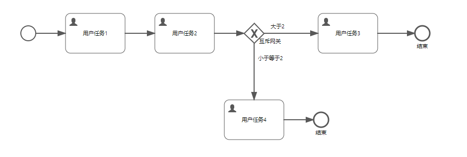
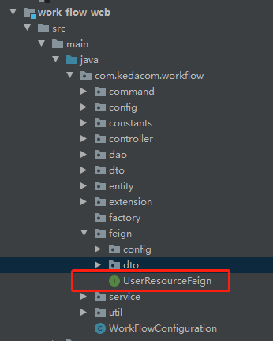
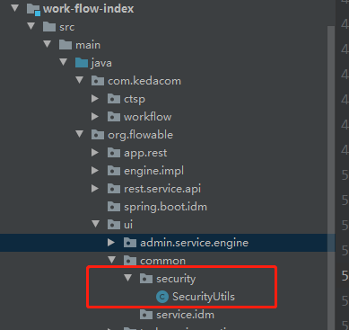
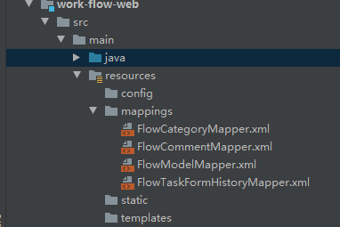
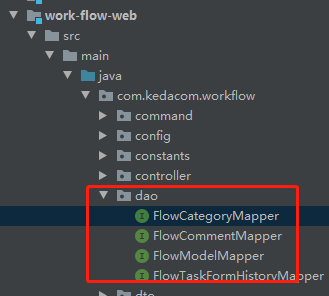

# 工作流后端项目

### 1. 项目混云地址

https://dolphin-dev.kedacom.com/ty-work-flow-front

### 2. flowable项目本身提供的rest接口文档

https://flowable.com/open-source/docs/bpmn/ch15-REST/

### 3. 后端项目结构

| 模块名           | 模块说明                                 | 补充                                                         |
| ---------------- | ---------------------------------------- | ------------------------------------------------------------ |
| work-flow-base   | 全局的统一处理（如异常处理、日志处理等） | 目前模块里的代码没有使用                                     |
| work-flow-flyway | 数据库脚本                               | `00`脚本是为了清理测试数据，一般情况不要执行，可以从项目里删了；`01,02`脚本是用于流程分类管理页面的，现在的需求好像没这个；`03`脚本的表是用于关联表单和流程任务 |
| work-flow-index  | 启动项目                                 | 启动类之外，对`flowable`项目的重写在`org.flowable`包下，对`kiaf`框架（主要是统一权限，还有移除`fastjson`的使用这些）的重写在`com.kedacom`包下 |
| work-flow-web    | 项目的接口、服务位置                     | 一般新增代码都写在这个模块里                                 |

### 4. 工作流相关概念

流程模型 → 流程定义 → 流程实例 → 用户任务

流程模型： 流程模型设计页面绘制的一张流程图在保存之后就是一个流程模型；（**无论前端样式怎么改，这里保存的数据格式必须要和以前的一致，否则后续流程流转不起来（如每个流程必须包含`启动`和`结束`节点等，这一部分可以参照混云上保存模型的格式）**）。（表单模型，可以在`流程表单管理`页面进行类似于`流程模型`的操作）

流程定义：一个流程模型可以多次发布，每次发布会生成一份流程定义；

流程实例：一个流程实例可以多次启动，每次启动会生成一份流程实例；

用户任务：上图中启动了流程实例后，系统会自动创建`用户任务1`的任务，可以对任务进行**审批**、**驳回**等流转。审批通过之后的任务就是**已办**，系统会自动创建`用户任务2`的待办任务。（具体流程可参照混云上的`流程处理`菜单里的任务相关页面）。

### 5.工作流数据库表

工作流数据中几乎所有的表都是项目自动生成的，自建的只有两张表（`flyway`模块中的脚本）

- **ACT_RE_***
  ’RE’表示repository（存储）。`RepositoryService`接口操作的表。带此前缀的表包含的是静态信息，如，流程定义，流程的资源（图片，规则等）。
- **ACT_RU_***
  ’RU’表示runtime。这是运行时的表存储着流程变量，用户任务，变量，职责（job）等运行时的数据。`flowable`只存储实例执行期间的运行时数据，当流程实例结束时，将删除这些记录。
- **ACT_ID_***
  ’ID’表示identity(组织机构)。这些表包含标识的信息，如用户，用户组，等等。（用户相关的表没有使用，现在用的是统一权限）
- **ACT_HI_***
  ’HI’表示history。就是这些表包含着历史的相关数据，如结束的流程实例，变量，任务，等等。
- **ACT_GE_***
  普通数据，各种情况都使用的数据

| 表名                  | 说明                                                         |
| --------------------- | ------------------------------------------------------------ |
| act_bpmn_category     | 自建表，用于流程定义分类，在启动发布模型的时候可选，`流程分类管理`页面做分类展示，非必要表 |
| act_task_form_history | 自建表，用于关联`表单`到`用户任务`                           |
| ACT_DE_MODEL          | 保存流程（表单）模型；核心字段：`model_type`区分流程和表单（2 - 表单，0 - 流程），`model_editor_json`是模型实际的json数据，`thumbnail`保存缩略图（新需求应该用不到） |
| ACT_RE_DEPLOYMENT     | 流程发布表（发布流程模型时自动添加，后续也用不到，可以不关注） |
| ACT_GE_BYTEARRAY      | 资源文件表，流程模型资源文件的真正存放地方，它每部署一次就会产生2条记录，一条是关于`bpmn`规范的文件内容存放在BYTES字段中，另一条是图片信息，采用二进制格式存储。（可以不关注） |
| ACT_RE_PROCDEF        | 流程定义表，`category_`字段对应`act_bpmn_category`表类别的`code` |
| ACT_HI_PROCINST       | 流程实例表，`start_user_id_`字段保存启动人的`username`（对应统一权限里的用户名） |
| ACT_RU_TASK           | 运行时任务表（待办任务），`assignee`字段保存被指派执行该任务的人的`username`，`form_key_` 关联的表单key（ACT_DE_MODEL表的`model_key`） |
| ACT_HI_TASKINST       | 历史任务表（已办任务） |
| ACT_RU_EXECUTION | 流程实例执行表 |
| ACT_RU_ACTINST | 流程实例运行时活动表 |
| ACT_HI_ACTINST | 流程实例历史活动表 |
| ACT_HI_COMMENT | 评论表，审批的时候可以加审批意见，这部分内容在这张表里。`user_id_`，`task_id_`记录用户和任务 |

更加详细的数据表描述： https://www.jianshu.com/p/acde3f985085

流程实例、活动实例、任务实例关系：https://blog.csdn.net/weixin_40816738/article/details/103077356

启动流程到完成任务数据库变化： https://blog.csdn.net/ccdust/article/details/52600804

### 6.其他补充内容

1. 当前如果要记录用户相关信息，都只记录统一权限中的用户名（`username`），查询返回的时候通过访问统一权限获取用户名称信息。（调用外部服务用的是`Open Feign`, `com.kedacom.workflow.feign`这个包下有一个使用例子）。

2. 后端可以直接获取登录用户的信息，是接口访问时从`jwt-token`或者`cookie`信息获取的

   

可以参照这个类里`getCurrentUserObject`方法获取用户的其他信息，核心是`Authentication`，不需要另外再调用统一权限的接口。

3. MyBatis文件位置

对应Dao层

接口定义和脚本对应不方便，可以在`idea`里装个MyBatis插件， `Free MyBatis plugin`